# Another Awesome Dataset List

:sparkling_heart::
* AI开发者神器！谷歌重磅推出数据集搜索 Dataset Search: https://mp.weixin.qq.com/s/ErbwXAz-_AJrmUGMHZIcwg
* Making it easier to discover datasets: https://www.blog.google/products/search/making-it-easier-discover-datasets/

> Please **cite related paper** if you **use their dataset**
>
> Every item need some images, links, and introductions... I need your help... :smile:

- [Another Awesome Dataset List](#Another-Awesome-Dataset-List)
  - [Saliency](#Saliency)
    - [RGB-Saliency Detection](#RGB-Saliency-Detection)
      - [MSRA(MSRA10K/MSRA-B)](#MSRAMSRA10KMSRA-B)
      - [SED1/2](#SED12)
      - [ASD(MSRA1000/MSRA1K)[need some images]](#ASDMSRA1000MSRA1Kneed-some-images)
      - [DUT-OMRON](#DUT-OMRON)
      - [DUTS](#DUTS)
      - [HKU-IS[need some iamges]](#HKU-ISneed-some-iamges)
      - [SOD](#SOD)
      - [iCoSeg](#iCoSeg)
      - [Infrared[need help]](#Infraredneed-help)
      - [ImgSal](#ImgSal)
      - [ECSSD/CSSD](#ECSSDCSSD)
      - [THUR15K](#THUR15K)
      - [Bruce-A[need help]](#Bruce-Aneed-help)
      - [Judd-A[need help]](#Judd-Aneed-help)
      - [PASCAL-S](#PASCAL-S)
      - [UCSB[need help]](#UCSBneed-help)
      - [OSIE[need help]](#OSIEneed-help)
      - [ACSD](#ACSD)
    - [Other Special SOD Datasets](#Other-Special-SOD-Datasets)
      - [XPIE](#XPIE)
      - [SOC](#SOC)
      - [SOS/MOS[need some images]](#SOSMOSneed-some-images)
      - [ILSO[need some images]](#ILSOneed-some-images)
      - [HS-SOD](#HS-SOD)
    - [Video Saliency Detection](#Video-Saliency-Detection)
      - [RSD(PKU-RSD)](#RSDPKU-RSD)
      - [STC[need help]](#STCneed-help)
    - [RGBD-Saliency Detection](#RGBD-Saliency-Detection)
      - [NLPR/RGBD1000](#NLPRRGBD1000)
      - [NJU400/2000](#NJU4002000)
      - [STEREO/SSB](#STEREOSSB)
      - [LFSD[nead img]](#LFSDnead-img)
      - [RGBD135/DES](#RGBD135DES)
    - [RGBT-Saliency Detection [need more information...]](#RGBT-Saliency-Detection-need-more-information)
      - [VT1000 Dataset](#VT1000-Dataset)
      - [VT821 Dataset](#VT821-Dataset)
    - [Other Saliency Dataset](#Other-Saliency-Dataset)
      - [KAIST Salient Pedestrian Dataset](#KAIST-Salient-Pedestrian-Dataset)
  - [Segmentation](#Segmentation)
    - [General[need help]](#Generalneed-help)
      - [DAVIS](#DAVIS)
      - [aNYU](#aNYU)
    - [About Person](#About-Person)
      - [Supervisely人像数据集](#Supervisely%E4%BA%BA%E5%83%8F%E6%95%B0%E6%8D%AE%E9%9B%86)
      - [Clothing Parsing](#Clothing-Parsing)
      - [HumanParsing-Dataset](#HumanParsing-Dataset)
      - [Look into Person (LIP)](#Look-into-Person-LIP)
      - [Taobao Commodity Dataset](#Taobao-Commodity-Dataset)
      - [Object Extraction Dataset](#Object-Extraction-Dataset)
      - [Clothing Co-Parsing (CCP) Dataset](#Clothing-Co-Parsing-CCP-Dataset)
      - [Baidu People segmentation dataset[need help]](#Baidu-People-segmentation-datasetneed-help)
  - [Matting](#Matting)
    - [alphamatting.com](#alphamattingcom)
    - [Composition-1k: Deep Image Matting](#Composition-1k-Deep-Image-Matting)
    - [Semantic Human Matting](#Semantic-Human-Matting)
    - [PFCN](#PFCN)
    - [Deep Automatic Portrait Matting](#Deep-Automatic-Portrait-Matting)
  - [Other](#Other)
    - [Large-scale Fashion (DeepFashion) Database](#Large-scale-Fashion-DeepFashion-Database)
  - [need your help...](#need-your-help)
  - [Reference](#Reference)
    - [Salient Object Detection: A Survey](#Salient-Object-Detection-A-Survey)
    - [Review of Visual Saliency Detection with Comprehensive Information](#Review-of-Visual-Saliency-Detection-with-Comprehensive-Information)
    - [Salient Object Detection in the Deep Learning Era: An In-Depth Survey](#Salient-Object-Detection-in-the-Deep-Learning-Era-An-In-Depth-Survey)
  - [More](#More)
    - [Similiar Projects](#Similiar-Projects)
    - [Research Institutes](#Research-Institutes)
    - [Resource Websites](#Resource-Websites)

## Saliency

### RGB-Saliency Detection

#### MSRA(MSRA10K/MSRA-B)

* 论文: [T. Liu, J. Sun, N. Zheng, X. Tang, and H.-Y. Shum, “Learningto detect a salient object,” inCVPR, 2007, pp. 1–8](http://mmlab.ie.cuhk.edu.hk/2007/CVPR07_detect.pdf)
* 主页：南开大学媒体计算实验室: <https://mmcheng.net/zh/msra10k/>
* 下载：
    * MSRA10K(formally named as THUS10000; [195MB](http://mftp.mmcheng.net/Data/MSRA10K_Imgs_GT.zip): images + binary masks):
        * Pixel accurate salient object labeling for **10000 images** from MSRA dataset.
        * Please cite our paper [https://mmcheng.net/SalObj/] if you use it.
        * Saliency maps and salient object region segmentation for other 20+ alternative methods are also available ([百度网盘](http://pan.baidu.com/s/1dEaQqlF#path=%252FShare%252FSalObjRes)).
    * MSRA-B ([111MB](http://mftp.mmcheng.net/Data/MSRA-B.zip): images + binary masks):
        * Pixel accurate salient object labeling for **5000 images** from MSRA-B dataset.
        * Please cite the corresponding paper [https://mmcheng.net/drfi/] if you use it.

> 我们通过检测输入图像中的显着对象来研究视觉注意力。我们将显着对象检测表示为图像分割问题，我们将显着对象与图像背景分开。我们提出了一系列新颖的特征，包括多尺度对比度，中心环绕直方图和颜色空间分布，以在本地，区域和全局描述显着对象。学习条件随机场以有效地组合这些特征以用于显着对象检测。我们还构建了一个**包含由多个用户标记的数以万计的完全标记图像的图像数据库**。据我们所知，它是第一个用于视觉注意算法定量评估的大型图像数据库。我们在此图像数据库上验证了我们的方法，该数据库在本文中是公开的。
>
> 人们可能对图像中的显着对象有不同的看法。为了解决“给定图像中可能是什么样的显着对象”的问题，我们通过在多个用户的图像中标记“基础事实”显着对象来进行投票策略。在本文中，我们关注图像中单个显着对象的情况。
>
> 显著性对象表示。通常，我们**将给定对象表示为给定image I中的二元mask** $A={a_x}$。对于每个像素x，$a_x∈{1,0}$是二进制标签，以指示像素是否属于显着对象。**为了标记和评估，我们要求用户绘制一个矩形来指定一个显着对象。我们的检测算法也输出一个矩形.**
>
> 图像来源。我们收集了一个非常大的图像数据库，其中130,099个来自各种来源的高质量图像，主要来自图像论坛和图像搜索引擎。然后我们手动选择60,000多个图像，每个图像包含一个显着对象或一个独特的前景对象。我们进一步选择了20,840张图片进行标记。在选择过程中，我们**排除了包含非常大的显着对象的任何图像**，从而可以更准确地评估检测的性能。
>
> 标记一致性。对于每个要标记的图像，我们请用户绘制一个矩形，该矩形包围图像中最大的对象根据他/她自己的理解。由不同用户标记的矩形通常不相同。为了减少标签的不一致性，我们从多个用户绘制的矩形中选择一个“真实”标签。

#### SED1/2

* 单目标

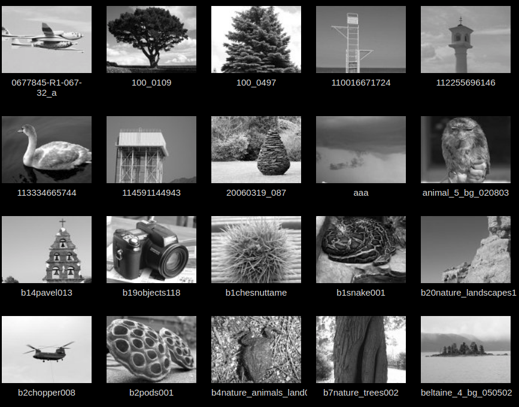

* 双目标

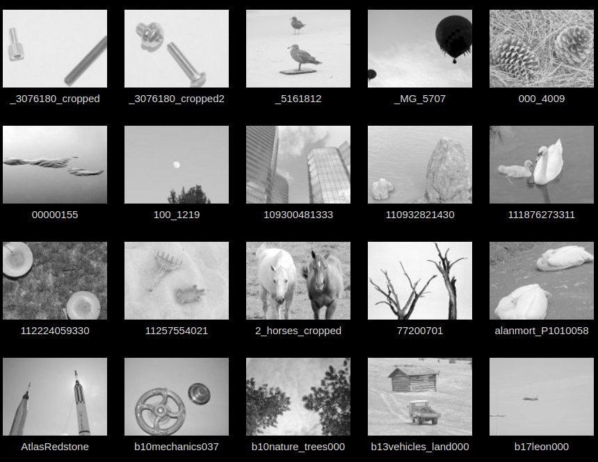

* 真值

给出的是每个图像由三个不同的人类对象分割的结果.

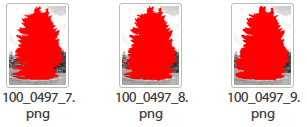

* [A. Borji, M.-M. Cheng, H. Jiang, and J. Li, “Salient objectdetection: A benchmark,”IEEE TIP, vol. 24, no. 12, pp. 5706–5722, 2015.](https://arxiv.org/abs/1501.02741)
* [Image Segmentation by Probabilistic Bottom-Up Aggregation and Cue Integration](http://www.wisdom.weizmann.ac.il/~meirav/Segmentation_Alpert_Galun_Brandt_Basri.pdf)
* 项目: <http://www.wisdom.weizmann.ac.il/~vision/Seg_Evaluation_DB/index.html>
* 下载: <http://www.wisdom.weizmann.ac.il/~vision/Seg_Evaluation_DB/dl.html>

> 这项工作的目的是为图像分割研究提供经验和科学依据。评估分割算法产生的结果具有挑战性，因为很难提出提供基础真实分割的规范测试集。这部分是因为在日常复杂图像中手动描绘片段可能是费力的。此外，人们往往倾向于将语义考虑纳入其分段中，这超出了数据驱动的分割算法的范围。因此，许多现有算法仅显示很少的分割结果。为了评估由不同算法产生的分割，我们编制了一个数据库，目前**包含200个灰度图像以及真实标注分割**。该数据库专门设计用于避免潜在的模糊，仅通过仅通过强度，纹理或其他低水平线索合并清晰描绘前景中与其周围环境不同的一个或两个物体的图像。通过要求人类对象手动地将灰度图像（还提供颜色源）分成两个或三个类别来获得地面真实分割，其中**每个图像由三个不同的人类对象分割**。通过评估其与真实分割的一致性及其碎片量来评估分割。与此数据库评估一起，我们提供了用于评估给定分割算法的代码。这样，不同的分割算法可能具有可比较的结果以获得更多细节，请参阅“评估测试”部分。

#### ASD(MSRA1000/MSRA1K)[need some images]

* 论文：[A two-stage approach to saliency detection inimages](https://www.researchgate.net/publication/224312323_A_two-stage_approach_to_saliency_detection_in_images)
* 相关：
    * T. Liu, J. Sun, N.-N. Zheng, X. Tang, and H.-Y. Shum, “[Learning to detect a salient object](http://research.microsoft.com/en-us/um/people/jiansun/salientobject/salient_object.htm),” in *Proc. IEEE Conf. Comput. Vis. Pattern Recognit.*, 2007, pp. 1–8.
    * R. Achanta, S. Hemami, F. Estrada, and S. Süsstrunk, “[Frequency-tuned salient region detection](http://ivrlwww.epfl.ch/supplementary_material/RK_CVPR09/),” in *Proc. IEEE Conf. Comput. Vis. Pattern Recognit.*, 2009, pp. 1597–1604.
* 下载: <http://download.csdn.net/detail/wanyq07/9839322>
    * 关于下载的说明：因为基于MSRA的图片数据集, 在孙剑走了之后, MARA上就没了他的页面, 相关的资源也就找不到了. CSDN一篇博客有分享。原图下载地址：[MSRA图像数据集（1000幅含真实标注）](http://download.csdn.net/detail/tuconghuan/8357509)。上面下载到的标注图尺寸被统一改为512*512，所以这里在给个地址：[ASD尺寸一致](http://download.csdn.net/detail/zzb4702/9559378)

> ASD contains 1,000 images with pixel-wise ground-truths. The images are selected from the MSRA-A dataset, where only the bounding boxes around salient regions are provided. The accurate salient masks in ASD are created based on object contours.
>
> 这个数据集包含有1000张图（MSRA1000）这个数据库来自于 该数据库的说明以及一些算法（IT, MZ, GB, SR, AC,IG ) 的结果可以在[Frequency-tuned Salient Region Detection](http://ivrlwww.epfl.ch/supplementary_material/RK_CVPR09/index.html) (FT算法 => 这里改进的数据集叫做ACSD, 相关可见[ACSD](#ACSD)部分)下载，此外其中还包含了这1000张测试图的真值图。

#### DUT-OMRON

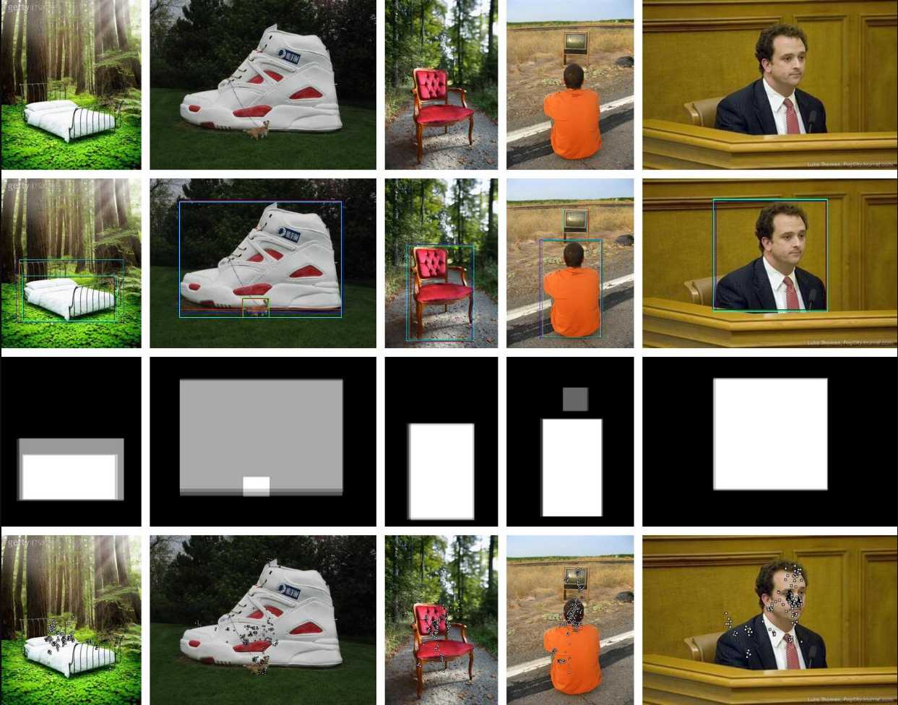

* 论文: C. Yang, L. Zhang, H. Lu, X. Ruan, and M.-H. Yang, “[Saliency detection via graph-based manifold ranking](http://saliencydetection.net/dut-omron/),” in *Proc. IEEE Conf. Comput. Vis. Pattern Recognit.*, 2013, pp. 3166–3173.
* 项目: <http://saliencydetection.net/dut-omron/#outline-container-org0e04792>
* 下载: <http://saliencydetection.net/dut-omron/download/DUT-OMRON-image.zip>

> 数据库包括从超过140,000张图像中手动选择的5,168个高质量图像。我们将图像的大小调整为宽为400或高为400像素，其中另一条边小于400.我们数据库的图像具有一个或多个显着对象和相对复杂的背景。我们共有25名参与者，用于汇总真值，每个图像有五个参与者标签。他们都有正常或矫正到正常的视力并且意识到我们实验的目标。我们为提出的数据库构建像素方面的真实标注, 边界框, 和眼睛固定标注真值。
>
> 我们的数据集是唯一一个具有眼睛固定，边界框和像素方面的大规模真实标注的数据集。与ASD和MSRA数据集以及其他一些眼睛固定数据集（即MIT和NUSEF数据集）相比，数据集中的图像更加困难，因此更具挑战性，并为相关的显着性研究提供了更多的改进空间。

#### DUTS

* 项目: <http://saliencydetection.net/duts/>

> ... we contribute a large scale data set named DUTS, **containing 10,553 training images and 5,019 test images**. All training images are collected from the ImageNet DET training/val sets, while test images are collected from the ImageNet DET test set and the SUN data set.
>
> Both the training and test set contain very challenging scenarios for saliency detection. Accurate pixel-level ground truths are manually annotated by 50 subjects.
>
> To our knowledge, DUTS is currently **the largest saliency detection benchmark** with the explicit training/test evaluation protocol.
>
> For fair comparison in the future research, the training set of DUTS serves as a good candidate for learning DNNs, while the test set and other public data sets can be used for evaluation.

#### HKU-IS[need some iamges]

* 项目: <https://i.cs.hku.hk/~gbli/deep_saliency.html>
* 论文: [Visual Saliency Based on Multiscale Deep Features](http://i.cs.hku.hk/~yzyu/publication/mdfsaliency-cvpr15.pdf)
* 下载:
    * [Google Drive](https://drive.google.com/open?id=0BxNhBO0S5JCRQ1N6V25VeVh6cHc&authuser=0)
    * [Baidu Yun](http://pan.baidu.com/s/1c0EpNfM)

> 数据集包含4447个具有显着对象的像素注释的图像
>
> 视觉显着性是包括计算机视觉在内的认知和计算科学中的一个基本问题。在本文中，我们发现可以从使用深度卷积神经网络（CNN）提取的多尺度特征中学习高质量的视觉显着性模型。视觉识别任务的成功。为了学习这样的显着性模型，我们引入了一种神经网络结构，它在CNN顶部具有完全连接的层，负责三个不同尺度的特征提取。然后，我们提出一种改进方法来增强我们的显着性结果的空间一致性。最后，针对不同级别的图像分割计算的聚合多个显着性图可以进一步提高性能，从而产生比由单个分割产生的显着性图更好的显着性图。为了促进对视觉显着性模型的进一步研究和评估，**我们还构建了一个新的大型数据库，包括4447个具有挑战性的图像及其像素显着性注释**。

#### SOD

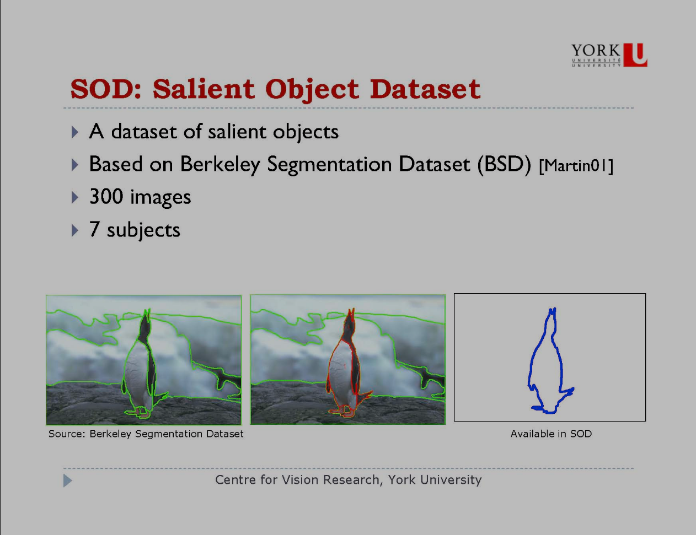

* 项目: <http://elderlab.yorku.ca/SOD/>
* 下载
    * 官方: <http://elderlab.yorku.ca/SOD/SOD.zip>
    * 百度云: <https://pan.baidu.com/s/1IMElTPwD4yTo2TMSRU-keQ>

> 此数据集是基于Berkeley Segmentation Dataset（BSD）的显着对象边界的集合。要求七个对象选择BSD中使用的每个图像中的显着对象。每个主题随机显示伯克利分割数据集的子集，作为在相应图像上重叠的边界。然后，可以通过单击选择哪些区域或区段对应于显着对象。
>
> 对于BSD中使用的300个图像的每个图像，都有一个.mat文件可以由Matlab打开。加载每个mat文件会将一个名为“SES”的结构读入内存，该结构是从SOD中每个主题的会话中收集的数据数组.
>
> :gift_heart: that the original images are available from the Berkely Segmentation Dataset at: [http://www.eecs.berkeley.edu/Research/Projects/CS/vision/grouping/segbench/](http://www.eecs.berkeley.edu/Research/Projects/CS/vision/grouping/segbench/)

#### iCoSeg

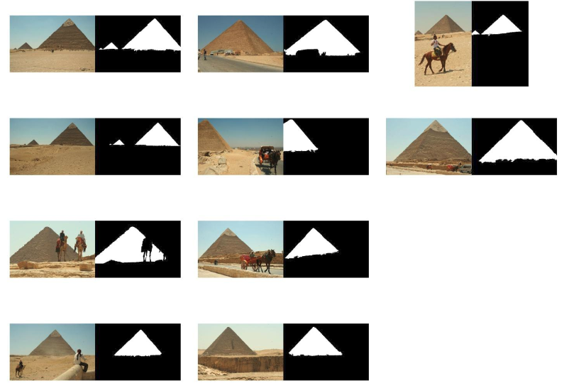

* 论文: <http://chenlab.ece.cornell.edu/projects/touch-coseg/iCoseg_dataset.pdf>
* 项目: <http://chenlab.ece.cornell.edu/projects/touch-coseg/>
* 下载: <http://chenlab.ece.cornell.edu/projects/touch-coseg/CMU_Cornell_iCoseg_dataset.zip>

> 我们引入了38组（643幅图像）中最大的公开可用的 co-segmentation，以及像素标注真值。

#### Infrared[need help]

* 项目: <https://ivrl.epfl.ch/research-2/research-downloads/supplementary_material-cvpr11-index-html/>
* 论文: <http://infoscience.epfl.ch/record/167478>
* 下载: <http://ivrgwww.epfl.ch/supplementary_material/cvpr11/nirscene1.zip>

> 我们使用对传统SLR相机的简单修改来捕获数百个彩色（RGB）和近红外（NIR）场景的图像。我们表明，近红外信息的添加导致场景识别任务中的性能显着提高，并且当使用适当的4维颜色表示时，改进仍然更大。特别地，我们提出了MSIFT-一种多光谱SIFT描述符，当与基于内核的分类器结合时，超过了现有技术的场景识别技术（例如GIST）及其多光谱扩展的性能。我们使用数百个RGB-NIR场景图像的新数据集对我们的算法进行了广泛的测试，并对Torralba的场景分类数据集进行了基准测试。

#### ImgSal

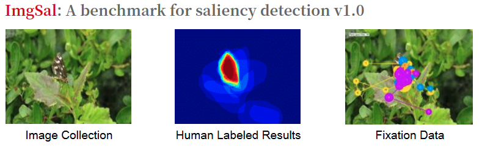

* 项目: <https://sites.google.com/site/jianlinudt/saliency-database>
* 作者主页: <http://www.escience.cn/people/jianli/DataBase.html>

> 数据库的特点
>
> 1. 235个彩色图像的集合，分为六个不同的类别;
> 2. 提供人类固定记录（扫视数据）和人类标记结果;
> 3. 易于使用。
>
> 我们将同时考虑不同大小的显着区域的检测。实际上，可接受的显着性检测器应该检测大的和小的显着区域。此外，显着性检测还应该定位杂乱背景中的显着区域和具有重复干扰物的区域。我们还注意到，对于任何显着性检测器，不同的图像呈现不同的难度。但是，现有的显着性基准（例如Bruce的数据集，Hou'dataset，Harel的数据集等）是图像集合，没有尝试对所需分析的难度进行分类。因此，我们为显着性模型验证创建了一个新的显着性基准。该数据库提供REGION基础事实（人类标记）和FIXATION基础事实（通过眼动仪）。
>
> 图像集使用Google以及参考最近的文献收集了包含235张图像的数据库。此数据库中的图像为480 x 640像素，分为6类：1）50个具有大显着区域的图像;2）具有中间显着区域的80幅图像;3）具有小显着区域的60幅图像;4）背景杂乱的15幅图像;5）带有重复干扰物的15张图像;6）具有大和小显着区域的15个图像。

#### ECSSD/CSSD

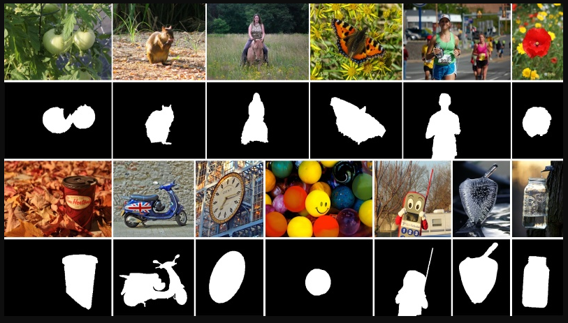

* 下载: <http://www.cse.cuhk.edu.hk/leojia/projects/hsaliency/dataset.html>
    * ECSSD (1000 images)
        * [ECSSD images (64.6MB)](http://www.cse.cuhk.edu.hk/leojia/projects/hsaliency/data/ECSSD/images.zip)
        * [ECSSD ground truth masks (1.78MB)](http://www.cse.cuhk.edu.hk/leojia/projects/hsaliency/data/ECSSD/ground_truth_mask.zip) (Updated on 9 April, 2015)
    * CSSD (200 images)
        * [CSSD images (18.7MB)](http://www.cse.cuhk.edu.hk/leojia/projects/hsaliency/data/CSSD/images.zip)
        * [CSSD groud truth masks (0.75MB)](http://www.cse.cuhk.edu.hk/leojia/projects/hsaliency/data/CSSD/ground_truth_mask.zip)

其中CSSD包含了200张图，而ECSSD是前者的扩展集包含有1000张图

> 虽然MSRA-1000的图像内容种类繁多，但背景结构主要是简单而流畅。为了表示自然图像通常落入的情况，我们将[1]中的复杂场景显着性数据集（CSSD）扩展到包含1000个图像的更大数据集（ECSSD）[2]，其中包含许多语义上有意义但结构复杂的图像用于评估。这些图像是从互联网上获取的，并要求5名助手制作地面真相面具。上面显示了几个带有相应掩模的例子。

#### THUR15K

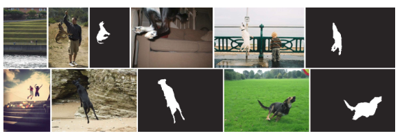

* 论文: <https://mmcheng.net/zh/gsal/>
* 下载: <https://mmcheng.net/mftp/Data/THUR15000.zip>
    * 百度云: <https://pan.baidu.com/s/1u-E-8ujnxBz0mdmXsJglvg>

> 有效识别大型图像集中的显着对象对于许多应用是必不可少的，包括图像检索，监视，图像注释和对象识别。我们提出了一种简单，快速，有效的算法，通过分析图像集合来定位和分割显着对象。作为一个关键的新颖性，我们通过提取最大化图像间相似性和图像内清晰度的显着对象（在预过滤图像的集合中）来引入群体显着性以实现优越的无监督显着对象分割。为了评估我们的方法，我们构建了一个大型基准数据集，**该数据集包含多个类别的15K图像，适用于显着对象区域的6000多个像素精确的地面实况注释**。在我们的所有测试中， group saliency 始终优于最先进的单图像显着性算法，从而实现更高的精度和更好的回忆。我们的算法成功处理了比任何现有基准数据集更大的订单的图像集合，包括来自各种网络间源的各种异构图像。
>
> 我们引入了分类图像的标记数据集，用于评估基于草图的图像检索。我们为5个关键字中的每一个下载了大约3000张图像：“蝴蝶”，“咖啡杯”，“狗跳”，“长颈鹿”和“平面”，一起包括大约15000张图像。**对于每个图像，如果存在具有与查询关键字匹配的正确内容的非模糊对象并且对象的大部分可见，则我们标记这样的对象区域。与MSRA10K类似，显着区域以像素级别标记。我们只标记几乎完全可见的对象的显着对象区域，因为部分遮挡的对象对形状匹配不太有用。与MSRA10K不同，THUR15K数据集不包含为数据集中的每个图像标记的显着区域，即，一些图像可能没有任何显着区域。该数据集用于评估基于形状的图像检索性能。**

#### Bruce-A[need help]

* 论文: <https://papers.nips.cc/paper/2830-saliency-based-on-information-maximization.pdf>

#### Judd-A[need help]

* 论文: <http://people.csail.mit.edu/torralba/publications/wherepeoplelook.pdf>

#### PASCAL-S

* 项目: <https://ccvl.jhu.edu/datasets/>
* 下载:
    * 百度云盘：<https://pan.baidu.com/s/1DZcfwCYdeMW4EGawhXQyig>
    * 种子: <http://academictorrents.com/download/6c49defd6f0e417c039637475cde638d1363037e.torrent>

> 对来自PASCAL VOC的850张图像子集的自由修复。收集8个主题，3s观看时间，Eyelink II眼动仪。大多数算法的性能表明PASCAL-S比大多数显着性数据集偏差更小。
>
> :broken_heart: 由于其标注的真值有多个值，常见的做法是使用`255/2`值作为阈值进行处理后，再使用该数据集

#### UCSB[need help]

* 论文: <https://www.ncbi.nlm.nih.gov/pmc/articles/PMC3954044/>
* 下载: <https://labs.psych.ucsb.edu/eckstein/miguel/research_pages/saliencydata.html>

#### OSIE[need help]

* 论文: <https://jov.arvojournals.org/article.aspx?articleid=2193943>

> 大量先前的模型用于预测人们在自然场景中的外观，侧重于像素级图像属性。为了弥合计算显着性模型的预测能力与人类行为之间的语义差距，我们提出了一种新的显着性体系结构，它将信息分为三个层次：像素级图像属性，对象级属性和语义级属性。通常忽略对象和语义级别信息，或者仅讨论少数样本对象类别，其中缩放到大量对象类别是不可行的，也不是神经合理的。为了解决这个问题，这项工作构建了一个基本属性的原则词汇表来描述对象和语义级信息，从而不限制有限数量的对象类别。我们**建立了一个包含500个图像的新数据集，其中包含15个观察者的眼动追踪数据和5,551个具有精细轮廓和12个语义属性的分段对象的注释数据**（可在论文中公开获得）。实验结果证明了对象和语义级信息在预测视觉注意力方面的重要性。

#### ACSD

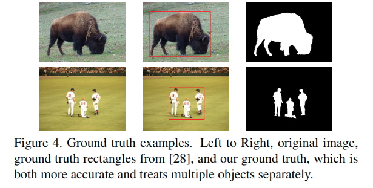

* 论文: [R. Achanta, S. Hemami, F. Estrada, and S. Ssstrunk, “Frequency-tuned salient region detection,” in CVPR, 2009, pp. 1597–1604](https://infoscience.epfl.ch/record/135217/files/1708.pdf)
* 项目: <https://ivrl.epfl.ch/research-2/research-current/research-saliency/supplementary_material-rk_cvpr09-index-html/>
* 下载: 官网只提供了[真值标注的下载](https://ivrl.epfl.ch/wp-content/uploads/2018/08/binarymasks.zip).

基于[ASD数据集(MSRA1K)](#ASD(MSRA1000 / MSRA1K))制作.

> 我们从[Z. Wang and B. Li. A two-stage approach to saliency detection in images. ICASSP 2008.]中提出的1000个图像中获得了一个真实数据库。[Z. Wang and B. Li. A two-stage approach to saliency detection in images. ICASSP 2008.]中的基本事实是在显着区域周围的用户绘制的矩形。这是不准确的，并将多个对象合二为一。我们手动分割用户绘制的矩形内的显着对象以获得二进制掩码，如下所示。这样的掩膜既准确又允许我们清楚地处理多个显着对象。

### Other Special SOD Datasets

#### XPIE

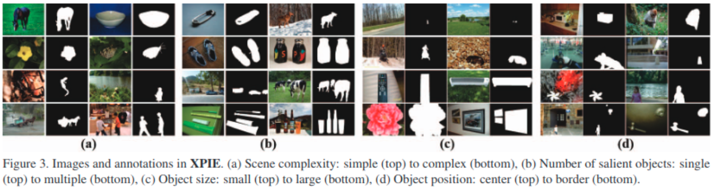

* 链接: [C.  Xia,  J.  Li,  X.  Chen,  A.  Zheng,  and  Y.  Zhang,  “What  is  and  what is not a salient object? Learning salient object detector by ensembling linear exemplar regressors,” in CVPR , 2017, pp. 4142–4150.](https://www.researchgate.net/publication/320971838_What_is_and_What_is_Not_a_Salient_Object_Learning_Salient_Object_Detector_by_Ensembling_Linear_Exemplar_Regressors)
* 团队: cvteam: <http://cvteam.net/>
* 项目：<http://cvteam.net/projects/CVPR17-ELE/ELE.html>
* 下载: <http://cvteam.net/projects/CVPR17-ELE/XPIE.tar.gz>

> 找出什么是什么和什么不是显着对象可以有助于在显着对象检测（SOD）中开发更好的特征和模型。在本文中，我们研究了在构建新的SOD数据集时选择和丢弃的图像，发现许多相似的候选者，复杂形状和低对象性是很多非显着对象的三个主要属性。此外，对象可能具有使其显着的不同属性。
>
> 为了全面解释什么是什么和什么不是显着对象，一个可行的解决方案是通过观察包含在数据集中或从数据集中丢弃的图像中的对象的主要特征来研究构建新SOD数据集的整个过程。从这些观察中，我们可以推断显着和非显着对象的关键属性以及基于图像的SOD数据集中可能存在的主观偏差。为此，我们构建了一个大的SOD数据集（称为XPIE）并记录构建过程中的所有细节。
>
> 1. 我们首先从三个来源收集三种图像，包括Panoramio，ImageNet和两个fixation数据集。这些操作是全自动的，以避免引入太多的主观偏见。
> 2. 之后，我们调整每个图像的大小，使其最大边长为300像素，并丢弃所有最小边长小于128像素的灰度或彩色图像。
> 3. 最后，我们在三个图像子集中获得29,600个彩色图像。分别表示为Set-P，Set-I, Set-E.
>
> **Set-P 包含8,800具有地理信息的感兴趣地点的图像（例如，GPS和标签），具有对象标签的Set-I包含19,600图像，以及Set-E包含1,200个human fixations图像**.
>
> 对于这些图像，我们要求两位工程师通过两个阶段对其进行注释。在第一阶段，图像被分配一个二进制标记：'是'用于包含非明确对象，否则为'否'。在第一阶段之后，我们将21,002张图片标记为“是”，并且8,598图像标记为“否”。在第二阶段，这两位工程师进一步要求手动标记标记为“是”的10,000张图像中的显着对象的准确边界。注意我们有10名志愿者参与整个过程，以检查注释的质量。**最后，我们获得了10,000张图像的二进制掩码**。
>
> 可见论文内容第2节。

#### SOC

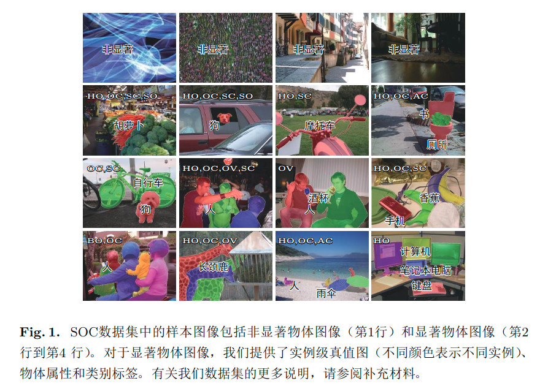

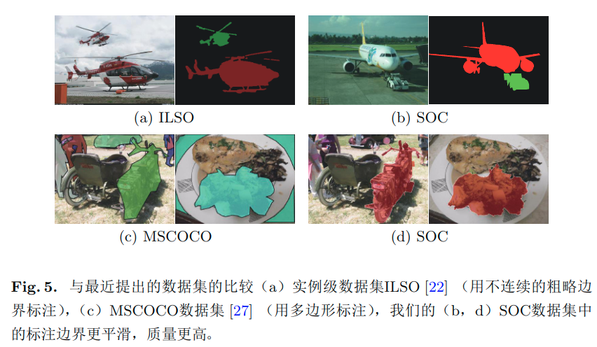

* 项目: <http://dpfan.net/SOCBenchmark/>
* 论文：[Salient Objects in Clutter: Bringing Salient Object Detection to the Foreground](http://dpfan.net/wp-content/uploads/2018/04/SOCBenchmark.pdf)
    * 中文: <http://dpfan.net/wp-content/uploads/SOCBenchmarkCN.pdf>
* 下载:
    * Overall 6K SOC Dataset  (730.2MB)  [Baidu](https://pan.baidu.com/s/1J8_CF7zE1zApqgAR9eS1Dw)[Google](https://drive.google.com/file/d/1hfo33A7diED2dikTpN9o4KnZTxizGdLr/view?usp=sharing)
    * 3.6K SOC Training Set (441.32MB) [Here](http://dpfan.net/wp-content/uploads/TrainSet.zip)[Baidu](https://pan.baidu.com/s/1Mao0piUuqVXAzmJoNtrtAw)[Google](https://drive.google.com/open?id=16jlzeJJ1tawyBLBN5fRiWbh2y_F0iSyP)
    * 1.2K  SOC Validation Set (146.56MB) [Here](http://dpfan.net/wp-content/uploads/ValSet.zip)[Baidu](https://pan.baidu.com/s/1mOmiezCpkr5NCQk8ecvGiQ)[Google](https://drive.google.com/open?id=1vAfP8fCAo2a2KwgsmYLn8r8Rk4Lk7Urr)
    * 1.2K  SOC Test Set (141.86MB) [Here](http://dpfan.net/wp-content/uploads/TestSet.zip)[Baidu](https://pan.baidu.com/s/10y-dx9HCPQm9fnp-Brswgw)[Google](https://drive.google.com/open?id=1ZdKrsk-S4J6KQyjx-cPeL0HoKXy7CCxG)

> 在本文中，我们提供了显着对象检测（SOD）模型的综合评估。我们的分析确定了现有SOD数据集的严重设计偏差，假设每个图像在低杂波中包含至少一个明显突出的显着对象。这是一个不切实际的假设。在现有数据集上进行评估时，设计偏差导致了最先进的SOD模型的饱和高性能。然而，当应用于现实世界的日常场景时，这些模型仍然远远不能令人满意。根据我们的分析，我们首先确定了全面和平衡的数据集应该实现的7个关键方面。然后，我们提出一个新的高质量数据集并更新以前的显着性基准。
>
> 具体来说，我们的数据集称为SOC，Salient Objects in Clutter，**包括来自日常对象类别的显着和非显着对象的图像**。除了对象类别注释之外，每个突出图像都伴随着反映现实世界场景中常见挑战的属性（例如，外观变化，杂乱），并且可以帮助 1）更深入地了解SOD问题，2）调查专业人员和SOD模型的缺点，3）从不同的角度客观地评估模型。最后，我们在SOC数据集上报告基于属性的性能评估。我们相信，我们的数据集和结果将为未来的显着物体检测研究开辟新的方向。
>
> SOC has 6,000 images with 80 common categories. Half of the images contain salient objects and the others contain none. **Each salient-object-contained image is annotated with instance-level SOD ground-truth, object category (e.g., dog, book), and challenging factors** (e.g., big/small object). **The non-salient object subset has 783 texture images and 2,217 real-scene images** (e.g., aurora, sky).

#### SOS/MOS[need some images]

* 项目：<http://cs-people.bu.edu/jmzhang/sos.html>
* 论文：
    * SOS: J. Zhang, S. Ma, M. Sameki, S. Sclaroff, M. Betke, Z. Lin, X. Shen, B. Price, and R. Mech, “Salient object subitizing,” in Proc. IEEE Conf. Comput. Vis. Pattern Recognit., 2015, pp. 4045–4054.
    * MOS: J. Zhang, S. Ma, M. Sameki, S. Sclaroff, M. Betke, Z. Lin, X. Shen, B. Price, and R. Mech, “Salient object subitizing,” in Proc. IEEE Conf. Comput. Vis. Pattern Recognit., 2015, pp. 4045–4054.

> SOS 10 is created for SOD subitizing [115], i.e., to predict the number of salient objects without an expensive detection process. It contains 6,900 images selected from:
>
> 1. A large-scale hierarchical image database
> 2. Sun database: Large-scale scene recognition from abbey to zoo
> 3. Microsoft coco: Common objects in context
> 4. The pascal visual object classes (voc) challenge results
>
> Each image is labeled as containing 0, 1, 2, 3 or 4+ salient objects. SOS is randomly split into a training (5,520 images) and a test set (1,380 images).
>
> **MSO is a subset of the test set of SOS and contains 1,224 images**. It has a more balanced distribution regarding the number of salient objects, and each object is annotated with a bounding box.

#### ILSO[need some images]

* 项目：<http://www.sysu-hcp.net/instance-level-salient-object-segmentation/>
* 论文：G. Li, Y. Xie, L. Lin, and Y. Yu, “Instance-level salient object segmentation,” in Proc. IEEE Conf. Comput. Vis. Pattern Recognit., 2017, pp. 247–256.

> ILSO has 1,000 images with pixel-wise instancelevel saliency annotations and coarse contour labeling, where the benchmark results are generated using MSRNet [Instance-level salient object segmentation]. Most of the images in ILSO are selected from the following datasets to reduce ambiguity over the salient object regions.
>
> 1. Visual saliency based on multiscale deep features
> 2. Hierarchical saliency detection
> 3. Saliency detection via graph-based manifold ranking
> 4. Salient object subitizing

#### HS-SOD

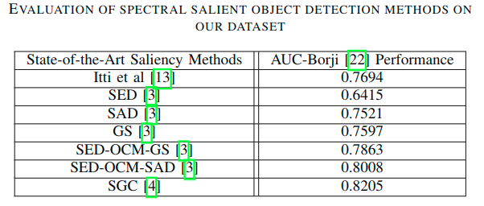

* 项目: <https://github.com/gistairc/HS-SOD>
* 下载: <http://data.airc.aist.go.jp/HS-SOD/HS-SOD.zip> 5.6G
* 论文: [Hyperspectral Image Dataset for Benchmarking on Salient Object Detection](https://arxiv.org/abs/1806.11314)

> 使用有监督或无监督的方法对着色对象进行了显着的物体检测。最近，一些研究表明，通过在来自天然景观的高光谱图像的可见光谱中使用光谱特征，也可以实现有效的显着对象检测。然而，这些关于高光谱显着物体检测的模型使用从各种在线公共数据集中选择的极少数数据进行测试，这些数据不是为了物体检测目的而特别创建的。因此，在这里，我们的目标是通过发布**具有60个高光谱图像的集合的高光谱显着物体检测数据集**以及**相应的地面实况二值图像**和**代表性的彩色图像（sRGB）**来指导该领域。我们在数据收集过程中考虑了几个方面，例如对象大小的变化，对象的数量，前景-背景对比度，图像上的对象位置等。然后，我们为每个高光谱数据准备了真值二进制图像，其中显著性目标被标记为图像。最后，我们使用曲线下面积（AUC）度量对文献中一些现有的高光谱显着性检测模型进行了性能评估。
>
> 这些数据是在东京港口码头公司的许可下，在日本东京台场的东京海滨城市公园收集的。我们在2017年8月至9月期间的几天内收集了数据，当时天气晴朗或部分多云。在每个数据收集日，使用三脚架固定相机以最小化图像上的运动失真。我们尝试根据日光条件尽可能地保持相机设置的曝光时间和增益，同时保持像素值饱和度或图像可见性。作为数据集用户的参考，我们提供相机设置，例如文本文件中每个图像的曝光时间和增益值以及相应的数据。我们也没有对捕获的波段应用标准化。它可以提高前景和背景区域之间色彩对比度更高的高光谱图像的质量;但是，它也可能降低数据集在显着对象检测任务上进行基准测试的难度。
>
> 在获得各种高光谱图像后，我们从大约50个不同的场景中选择了60个图像，条件是：i）我们去除了由于场景中的运动引起的失真图像（取决于曝光时间，一个图像可能需要几秒钟才能用于相机），ii）我们考虑了几个方面，如显着物体大小的变化，图像上物体的空间位置，显着物体的数量，前景 * 背景对比度，iii）一些图像具有相同的场景但物体位置，物距或数量对象各不相同。
>
> 为了便于显着物体检测任务，我们在可见光谱周围裁剪光谱带，并在传感器暗噪声校正后以“.mat”文件格式保存每个场景的超立方体。如[21]中所定义，可见光谱具有380-780nm的良好可接受范围，但也可以使用[3,4]中的400-700nm范围。为了保持范围广泛和灵活性，想要使用数据集的人，我们在[21]中为我们的数据集选择了380 * 780 nm的定义范围，尽管在人类视觉系统的这些范围的边界处视觉刺激可能较弱。然后，我们使用高光谱图像渲染sRGB彩色图像，通过标记显着对象的边界来创建地面真实显着对象二进制图像。

HS-SOD.zip file contains three folders:

1. hyperspectral: containing 60 hyperspectral images with #spatial rows:768 #spatial columns:1024 #spectral channels:81 (data only within visible spectrum: 380 nm -720 nm)
2. color: 60 color images of hyperspectral dataset rendered in sRGB for visualization
3. ground-truth: 60 ground-truth binary images for salient objects

### Video Saliency Detection

#### RSD(PKU-RSD)

* 论文: [J. Li, Y. Tian, T. Huang, and W. Gao, “A dataset and evaluation methodology for visual saliency in video,” in IEEE ICME, 2009, pp. 442–445](https://ieeexplore.ieee.org/document/5202529)
* 项目: <https://pkuml.org/resources/dataset.html>
* 下载: <https://pkuml.org/resources/pku-rsd.html>

> 我们构建了这个PKU-RSD（区域显着性数据集）数据集，可以捕获时空视觉显着性，用于评估不同的视频显着性模型。该数据集包含431个短视频，其涵盖各种场景（监视，广告，新闻，卡通，电影等）以及由23个主题手动标记的采样关键帧中的显着对象的相应注释结果。

#### STC[need help]

* 论文: [Y. Wu, N. Zheng, Z. Yuan, H. Jiang, and T. Liu, “Detection of salient objects with focused attention based on spatial and temporal coherence,” Chinese Science Bulletin, vol. 56, pp. 1055–1062, 2011.](https://pdfs.semanticscholar.org/3347/c330ac5586020ebea60823b1fd4e8d68e936.pdf?_ga=2.181072804.269179473.1546092428-61549168.1544104573)
* 下载: This dataset is freely available from the author

> 对视频内容的理解和分析对于众多应用程序来说至关重要，包括视频摘要，检索，导航和编辑。此过程的一个重要部分是检测视频片段中的显着（通常意味着重要和有趣）对象。与现有方法不同，我们提出了一种将显着性测量与空间和时间相干性相结合的方法。空间和时间一致性的整合受到人类视觉中关注焦点的启发。在所提出的方法中，低级视觉分组线索的空间相干性（例如外观和运动）有助于每帧对象背景分离，而对象属性的时间一致性（例如形状和外观）确保一致物体随时间定位，因此该方法对于意外的环境变化和相机振动是鲁棒的。在**开发了基于粗到细多尺度动态规划的有效优化策略之后，我们使用可与本文一起免费获得的具有挑战性的数据集来评估我们的方法**。我们展示了两种类型的一致性的有效性和互补性，并证明它们可以显着提高视频中显着对象检测的性能。

### RGBD-Saliency Detection

#### NLPR/RGBD1000

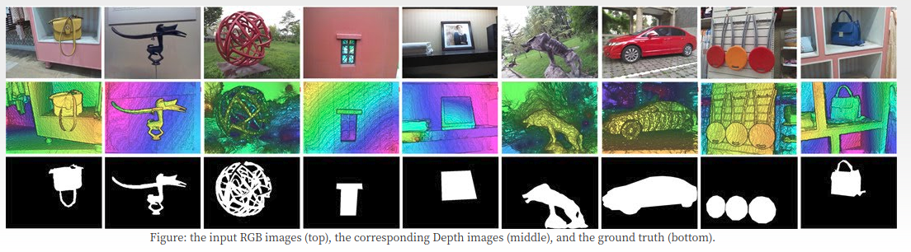

* 论文: [Rgbd salient object detection: a benchmark and algorithms](https://docs.google.com/uc?authuser=0&id=0B1wzzt1_uP1rb250d0t6dVFXWG8&export=download)
* 项目: <https://sites.google.com/site/rgbdsaliency/home>
* 下载: <https://sites.google.com/site/rgbdsaliency/dataset>

> NLPR is also called RGBD1000 dataset which including 1,000 images. There may exist multiple salient objects in each image. The structured light depth images are obtained by the Microsoft Kinect under different illumination conditions.
>
> 虽然深度信息在人类视觉系统中起着重要作用，但在现有的视觉显着性计算模型中尚未得到很好的探索。在这项工作中，**我们首先引入了一个大规模的RGBD图像数据集，以解决目前RGBD显着目标检测研究中数据不足的问题**。为了确保大多数现有的RGB显着模型在RGBD场景中仍然足够，我们继续提供一个简单的融合框架，将现有的RGB产生的显着性与新的深度诱导显着性相结合，前者是从现有的RGB模型中估算的，而前者是后者基于提出的多上下文对比模型。此外，还提出了一种专门的多阶段RGBD模型，其考虑了来自低级特征对比度，中级区域分组和高级先验增强的深度和外观线索。大量实验表明，我们的模型能够准确定位RGBD图像中的显着对象，并为目标对象分配一致的显着性值。

#### NJU400/2000

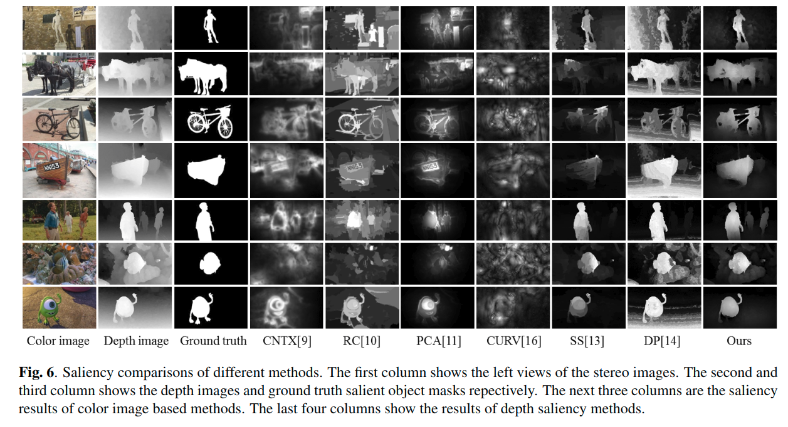

* 论文:
  * [NJU400: Depth saliency based on anisotropic center-surround difference](http://mcg.nju.edu.cn/publication/2014/icip14-jur.pdf)
  * [NJU2000: Depth-aware salient object detection using anisotropic center-surround difference](http://mcg.nju.edu.cn/publication/2015/spic15-jur.pdf)
* 团队: [MGG](http://mcg.nju.edu.cn/index.html)
* 项目: <http://mcg.nju.edu.cn/publication/2014/icip14-jur/index.html>
* 下载：
  * <http://mcg.nju.edu.cn/resource.html>
  * <http://mcg.nju.edu.cn/dataset/nju400.zip>
  * <http://mcg.nju.edu.cn/dataset/nju2000.zip>

> NJU2000 contains 2003 stereo image pairs with diverse objects and complex, challenging scenarios, along with ground-truth map. The stereo images are gathered from 3D movies, the Internet, and photographs taken by a Fuji W3 stereo camera.

#### STEREO/SSB

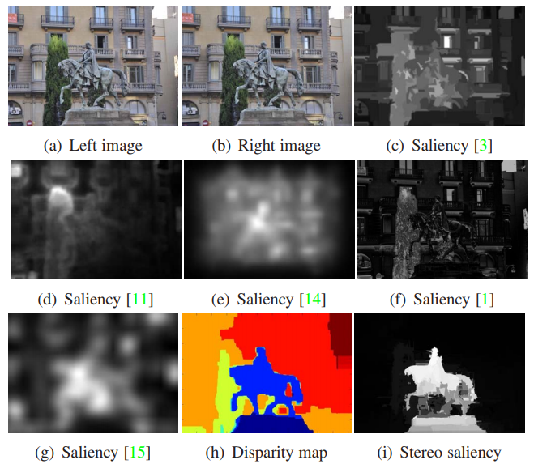

* 论文: [Leveraging stereopsis for saliency analysis](http://web.cecs.pdx.edu/~fliu/papers/cvpr2012.pdf)
* 项目: <http://web.cecs.pdx.edu/~fliu/>
* 下载: 请到主页寻找，需要联系作者。

> SSB is also called STEREO dataset, which consists of 1000 pairs of binocular images.

#### LFSD[nead img]

* 论文：Saliency detection on light field
* 项目：<https://sites.duke.edu/nianyi/publication/saliency-detection-on-light-field/>
* 下载：请到主页寻找，需要联系作者。

> LFSD is a small dataset which contains 100 images with depth information and human labeled ground truths. The depth information was obtained via the Lytro light field camera.

#### RGBD135/DES

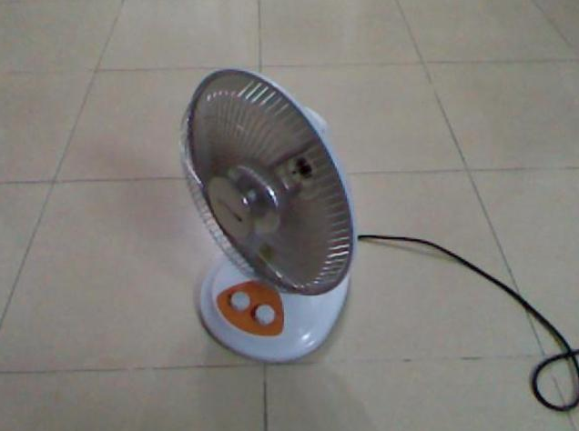

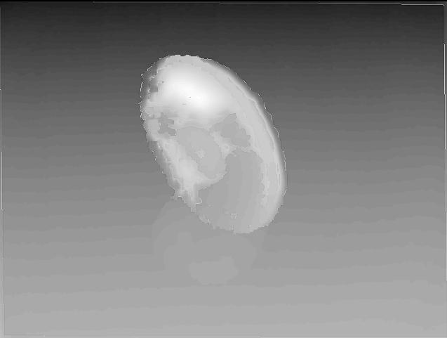

* 论文：[Depth enhanced saliency detection method](http://delivery.acm.org/10.1145/2640000/2632866/p23-cheng.pdf?ip=202.118.97.210&id=2632866&acc=ACTIVE%20SERVICE&key=BF85BBA5741FDC6E%2E5FC7500D8F9CB386%2E4D4702B0C3E38B35%2E4D4702B0C3E38B35&__acm__=1557798709_a26e3faff3faccad6d62e02d79d1921a)
* 项目：<https://github.com/HzFu/DES_code>
* 下载：项目主页提供了下面的下载链接诶：
    * <https://onedrive.live.com/redir?resid=F3A8A31ABFAC51B0!256&authkey=!AC4-yOEjn0bgrCQ&ithint=file%2crar>
    * <https://pan.baidu.com/s/1pLv2B8n>

> RGBD135 is also named DES which consists of seven indoor scenes and contains 135 indoor images collected by Microsoft Kinect.

### RGBT-Saliency Detection [need more information...]

#### VT1000 Dataset

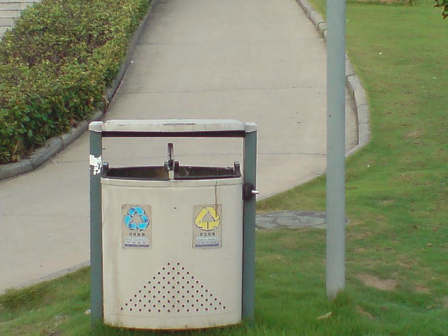

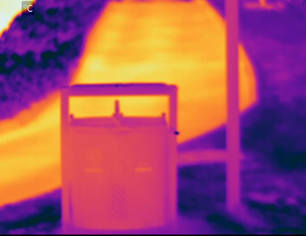

* 论文：RGB-T Image Saliency Detection via Collaborative Graph Learning
* 项目：http://chenglongli.cn/people/lcl/dataset-code.html
* 下载：具体信息可见项目主页
    * https://drive.google.com/file/d/1NCPFNeiy1n6uY74L0FDInN27p6N_VCSd/view?usp=sharing
    * https://pan.baidu.com/s/1eGQJhvnKnqV1KJ1GY_63NA

#### VT821 Dataset

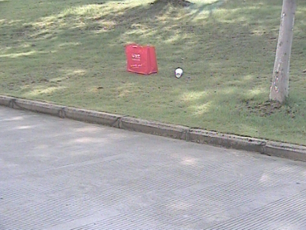

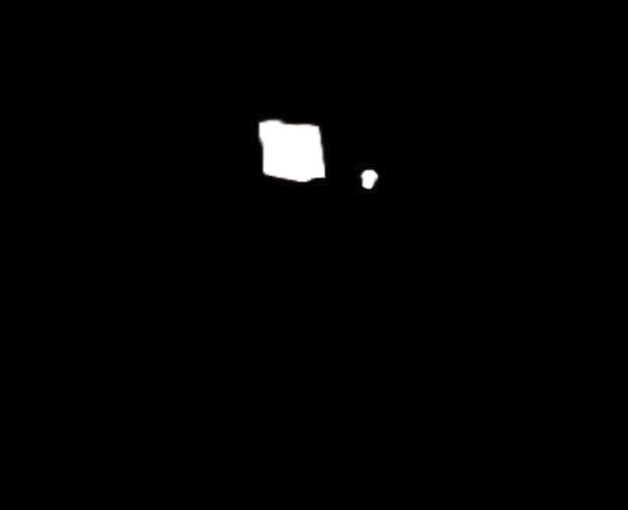

* 论文：A Unified RGB-T Saliency Detection Benchmark: Dataset, Baselines, Analysis and A Novel Approach
* 项目：http://chenglongli.cn/people/lcl/dataset-code.html
* 下载：具体信息可见项目主页
    * https://drive.google.com/file/d/0B4fH4G1f-jjNR3NtQUkwWjFFREk/view?usp=sharing
    * http://pan.baidu.com/s/1bpEaeQV

### Other Saliency Dataset

#### KAIST Salient Pedestrian Dataset

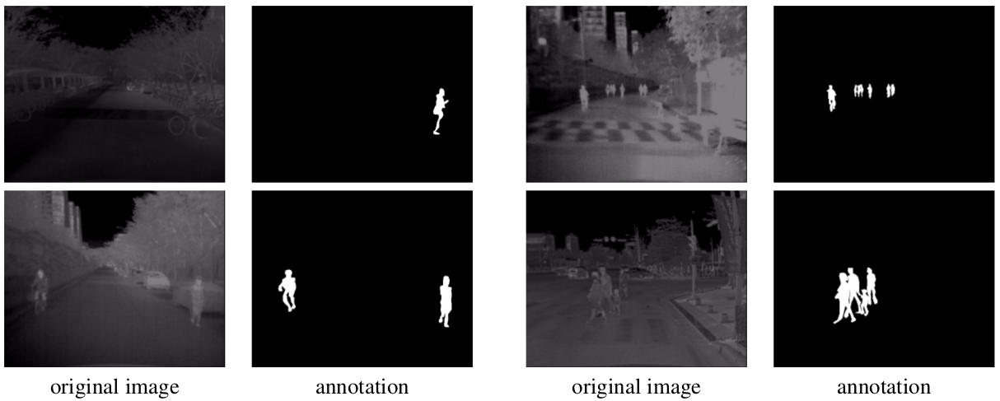

* 论文：Pedestrian Detection from Thermal Images using Saliency Maps
* 项目：https://github.com/Information-Fusion-Lab-Umass/Salient-Pedestrian-Detection
* 下载：具体详见项目页面

> We select 1702 images from the training set of the KAIST Multispectral Pedestrian dataset, by sampling every 15th image from all the images captured during the day and every 10thimage from all the images captured during the night, which contain pedestrians. These images were selected in order to have approximately the same number of images captured on both times of the day (913 day images and 789 night images), containing 4170 instances of pedestrians. We manually annotate these images using the VGG Image Annotator tool to generate the ground truth saliency masks based on the location of the bounding boxes on pedestrians in the original dataset. Additionally, we create a set of 362 images with similar annotations from the test set to validate our deep saliency detection networks, with 193 day images and 169 night images, containing 1029 instances of pedestrians.

## Segmentation

### General[need help]

#### DAVIS

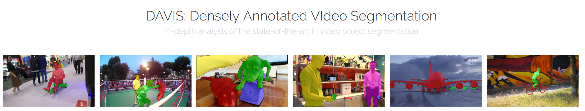

* 项目:
    * 竞赛主页: <https://davischallenge.org/index.html>
* 论文: [A Benchmark Dataset and Evaluation Methodology for Video Object Segmentation](https://www.cv-foundation.org/openaccess/content_cvpr_2016/papers/Perazzi_A_Benchmark_Dataset_CVPR_2016_paper.pdf)
* 下载:
    * [DAVIS 2016](https://davischallenge.org/davis2016/code.html) In each video sequence a single instance is annotated.
    * [DAVIS 2017](https://davischallenge.org/davis2017/code.html) In each video sequence multiple instances are annotated.

#### aNYU

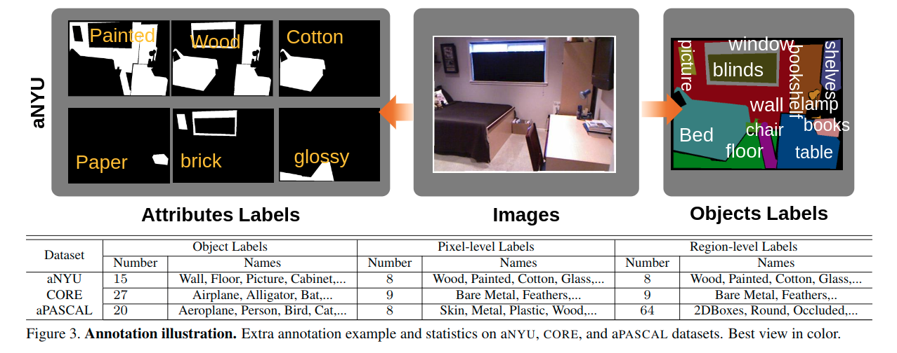

* 项目: <https://kylezheng.org/research-projects/densesegattobj/>
* 论文: [Dense Semantic Image Segmentation with Objects and Attributes](http://kylezheng.org/densesegattobjdataset/denseseg4objatt_CVPR2014_Kyle.pdf)
* 下载:
    * NYU: <http://cs.nyu.edu/~silberman/datasets/nyu_depth_v2.html>
    * aNYU: <http://www.robots.ox.ac.uk/~szheng/aNYU/aNYU.tar.gz>

> 我们的第一组实验是关于来自NYU V2 dataset的RGB图像。如图3所示，我们添加了8个附加属性标签，即木制，彩绘，棉花，玻璃，光面，塑料，闪亮和纹理。我们要求3个注释者在每个分割地面真实区域上分配材料，表面属性属性。Wethen将3名工作者的多数票作为我们的8个附加属性标签。我们将此扩展数据集称为attribute NYU（aNYU）数据集。**该数据集从28个不同的室内场景中收集了1449个图像。**在我们的实验中，我们选择了具有足够数量实例的15个对象类和8个属性来训练unary potential。此外，**我们随机地将数据集分成训练集的725个图像，验证集的100个，以及测试集的624个。**

### About Person

#### Supervisely人像数据集

* 项目: <https://supervise.ly/>

> * 数据集 **由5711张图片组成，有6884个高质量的标注的人体实例**。
> * 下面的所有步骤在Supervisely内部完成的，没有任何编码。
> * 更重要的是，这些步骤是被我内部的注释器执行的，没有任何机器学习专业知识。数据科学家仅仅只是控制和管理这过程。
> * 注释组由两名成员组成并且这整个过程只花了4天。

#### Clothing Parsing

* 项目 :
    * <http://vision.is.tohoku.ac.jp/~kyamagu/research/clothing_parsing/>
    * <http://vision.is.tohoku.ac.jp/~kyamagu/research/paperdoll/>

> In this paper we demonstrate an effective method for parsing clothing in fashion photographs, an extremely challenging problem due to the large number of possible garment items, variations in configuration, garment appearance, layering, and occlusion. In addition, we provide a large novel dataset and tools for labeling garment items, to enable future research on clothing estimation. Finally, we present intriguing initial results on using clothing estimates to improve pose identification, and demonstrate a prototype application for pose-independent visual garment retrieval.

#### HumanParsing-Dataset

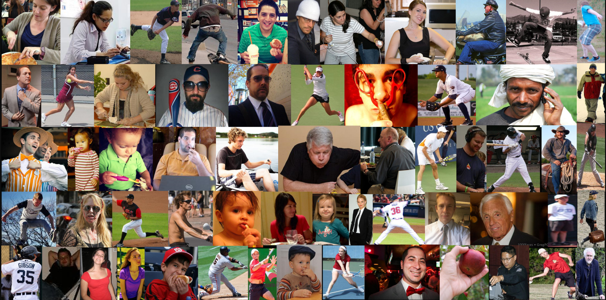

* 项目:
    * <https://github.com/lemondan/HumanParsing-Dataset>
    * <http://www.sysu-hcp.net/deep-human-parsing/>
    * <https://vuhcs.github.io/>
* 组织: <http://sysu-hcp.net/>
* 下载:  <http://pan.baidu.com/s/1qY8bToS> *passwd：kjgk*

> This human parsing dataset includes the detailed pixel-wise annotations for fashion images, which is proposed in our TPAMI paper “Deep Human Parsing with Active Template Regression”, and ICCV 2015 paper “Human Parsing with Contextualized Convolutional Neural Network”. This dataset contains 7700 images.We use 6000 images for training,1000 for testing and 700 as the validation set.

#### Look into Person (LIP)

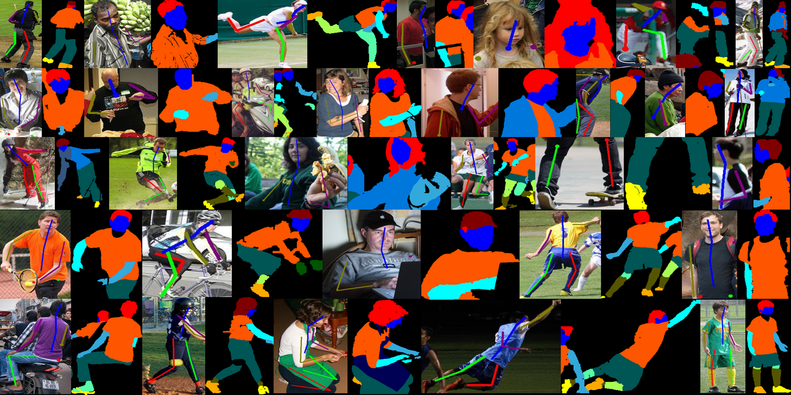

* 项目: <http://sysu-hcp.net/lip/overview.php>
* 下载: 不同任务有不同部分, 具体可见[Dataset](http://sysu-hcp.net/lip/overview.php)页面

> Look into Person (LIP) is a new large-scale dataset, focus on semantic understanding of person. Following are the detailed descriptions.
>
> The dataset contains 50,000 images with elaborated pixel-wise annotations with 19 semantic human part labels and 2D human poses with 16 key points.
>
> The annotated 50,000 images are cropped person instances from COCO dataset with size larger than 50 * 50.The images collected from the real-world scenarios contain human appearing with challenging poses and views, heavily occlusions, various appearances and low-resolutions. We are working on collecting and annotating more images to increase diversity.

#### Taobao Commodity Dataset

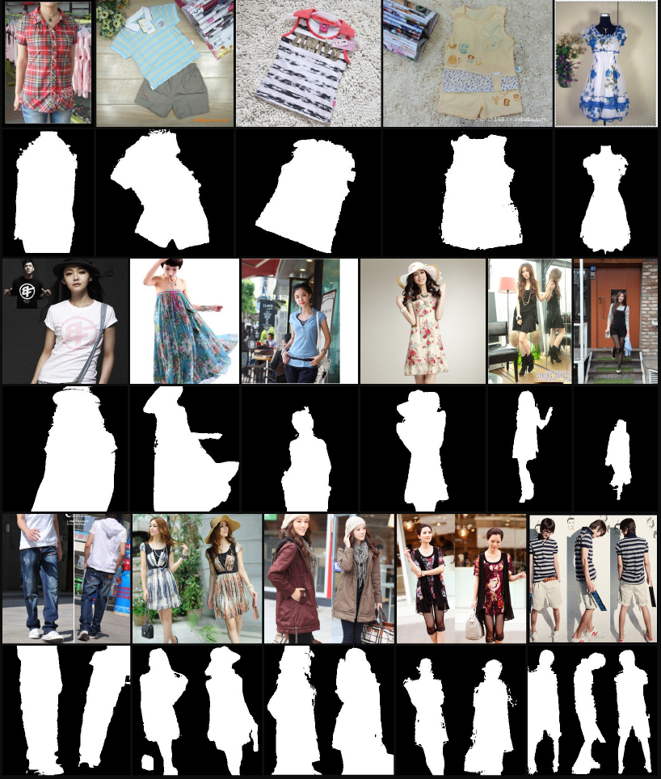

* 项目: <http://www.sysu-hcp.net/taobao-commodity-dataset/>
* 下载:
    * <http://www.sysu-hcp.net/wp-content/uploads/2016/03/Imgs_TCD.zip>
    * <http://www.sysu-hcp.net/wp-content/uploads/2016/03/Mask_TCD.zip>

> TCD contains 800 commodity images (dresses, jeans, T-shirts, shoes and hats) from the shops on the Taobao website. The ground truth masks of the TCD dataset are obtained by inviting common sellers of Taobao website to annotate their commodities, i.e., masking salient objects that they want to show from their exhibition. These images include all kind   s of commodity with and without human models, thus having complex backgrounds and scenes with highly complex foregrounds. Pixel-accurate ground truth masks are given. These images including all kinds of commodities with and without human models have complex backgrounds and scenes with large foregrounds for evaluation. Figure 1 illustrates some of them.

#### Object Extraction Dataset

* 项目: <https://objectextraction.github.io/>

> This Object Extraction newly collected by us contains 10183 images with groundtruth segmentation masks. We selected the images from the PASCAL, iCoseg, Internet dataset as well as other data (most of them are about people and clothes) from the web. We randomly split the dataset with 8230 images for training and 1953 images for testing.

#### Clothing Co-Parsing (CCP) Dataset

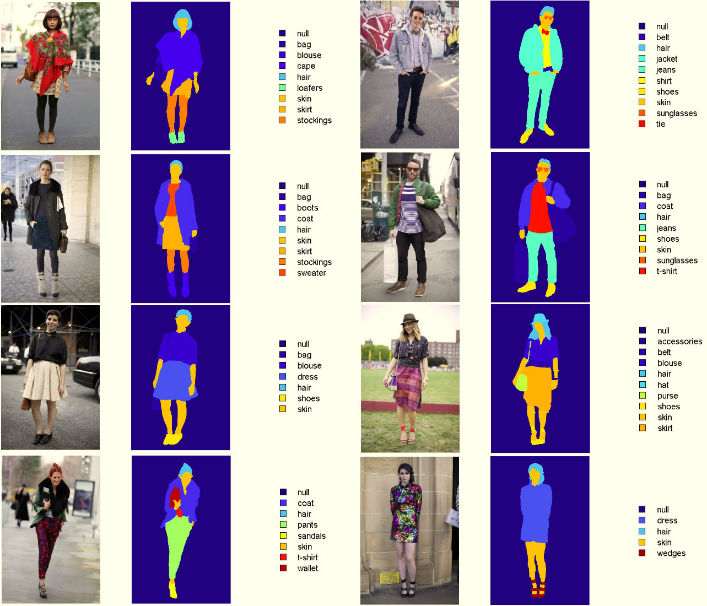

* 项目: <https://github.com/bearpaw/clothing-co-parsing>

> Clothing Co-Parsing (CCP) dataset is a new clothing database including elaborately annotated clothing items.
> 2, 098 high-resolution street fashion photos with totally 59 tags
> Wide range of styles, accessaries, garments, and pose
> All images are with image-level annotations
> 1000+ images are with pixel-level annotations

#### Baidu People segmentation dataset[need help]

* 下载: <http://www.cbsr.ia.ac.cn/users/ynyu/dataset/>

> 这个数据集主要是用于人体整体分割。它由5387张训练图片组成，但是测试图片没有公布。因此训练时可以从5387中随机挑选500张作为验证集，然后4887张作为训练集。参考论文《Early Hierarchical Contexts Learned by CNN for image segmentation》。
>
> 原文：https://blog.csdn.net/mou_it/article/details/82225505

## Matting

### alphamatting.com

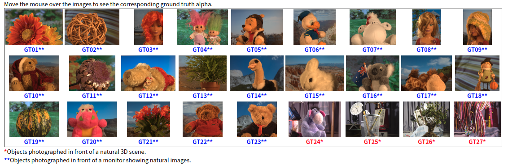

* 项目: <http://alphamatting.com/datasets.php>

| Download | Low resolution | High resolution |
| --- | --- | --- |
| Input images         | [input_training_lowres.zip](http://alphamatting.com/datasets/zip/input_training_lowres.zip) | [input_training_highres.zip](http://alphamatting.com/datasets/zip/input_training_highres.zip) |
| User input (trimaps) | [trimap_training_lowres.zip](http://alphamatting.com/datasets/zip/trimap_training_lowres.zip) | [trimap_training_highres.zip](http://alphamatting.com/datasets/zip/trimap_training_highres.zip) |
| Ground truth alpha   | [gt_training_lowres.zip](http://alphamatting.com/datasets/zip/gt_training_lowres.zip) | [gt_training_highres.zip](http://alphamatting.com/datasets/zip/gt_training_highres.zip) |

> 这是图像matting方法的现有基准。它**包括8个测试图像，每个图像有3个不同的三维图形**，即“small”，“large”和“user”

### Composition-1k: Deep Image Matting

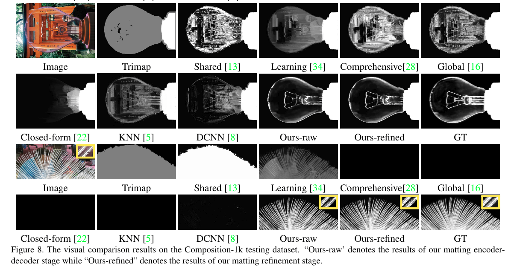

* 项目: <https://sites.google.com/view/deepimagematting>
* 论文: <https://arxiv.org/abs/1703.03872>
* 下载: Please contact Brian Price (bprice@adobe.com) for the dataset.

> 抠图是一个基本的计算机视觉问题，有许多应用。当图像具有相似的前景色和背景色或复杂的纹理时，先前的算法具有差的性能。主要原因是先前的方法 1）仅使用低级功能和2）缺乏高级上下文。在本文中，我们提出了一种新的基于深度学习的算法，可以解决这两个问题。我们的深层模型有两个部分。第一部分是深度卷积编码器 * 解码器网络，它将图像和相应的trimap作为输入并预测图像的alpha遮罩。第二部分是一个小的卷积网络，它改进了第一个网络的alpha遮罩预测，以获得更准确的alpha值和更清晰的边缘。此外，**我们还创建了一个大型图像抠图数据集，包括49300个训练图像和1000个测试图像**。我们在抠图基准，我们的测试集和各种真实图像上评估我们的算法。实验结果清楚地证明了我们的算法优于以前的方法。
>
> 我们使用合成创建一个大规模的matting数据集。仔细提取具有简单背景上的对象的图像并将其合成到新的背景图像上以创建具有49300（45500）个训练图像和1000个测试图像的数据集。
>
> ......
>
> 我们将评估3个数据集上的方法。1）我们评估alphamatting.com数据集，这是图像matting方法的现有基准。它**包括8个测试图像，每个图像有3个不同的三维图形**，即“小”，“大”和“用户”。2）由于alphamatting.com数据集中对象的大小和范围有限，**我们提出了Composition-1k测试集。我们基于作品的数据集包括1000个图像和50个独特的前景。此数据集具有更广泛的对象类型和背景场景。**3）为了测量我们在自然图像上的表现，我们还收集了包括31个自然图像的第三个数据集。

### Semantic Human Matting

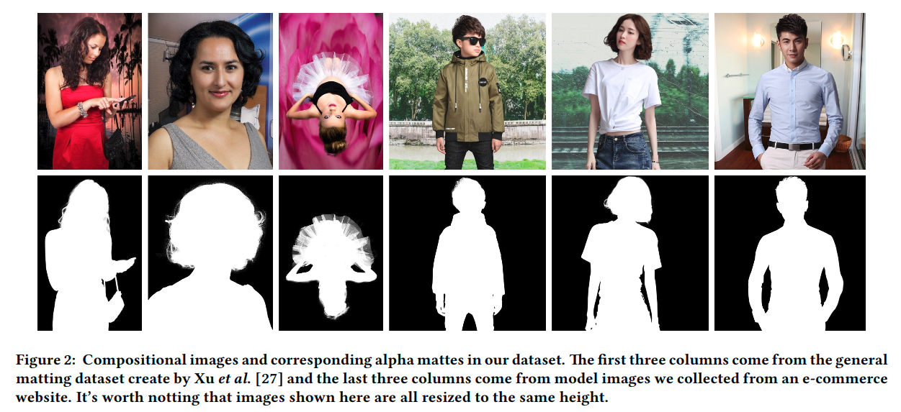

* 论文: <https://arxiv.org/abs/1809.01354>

> * alpha matting 的資料庫樣本過少，對於深度學習來說首要條件就是資料樣本要多
> * Shen et al. 此資料庫是透過 CF 以及 KNN 的方式所製造的， 因此有可能該資料庫有bias，不採用。（這部分可搜尋幾個關鍵字： deep learning dataset bias）。
> * DIM 的資料庫雖然有 493 個物件， 但是物件中包含人物的只有 202 個。
> * Our dataset 從電子商務網站中搜集圖片，將35,513個人物透過人工標注他的Annotation，此資料集有遵循DIM的方法收集。
>
> https://medium.com/@xiaosean5408/%E6%B7%98%E5%AF%B6%E7%B6%B2%E7%9A%84%E4%BA%BA%E7%89%A9%E6%8F%90%E5%8F%96%E8%AB%96%E6%96%87%E7%B0%A1%E4%BB%8B-semantic-human-matting-52591c3f8e0c

### PFCN

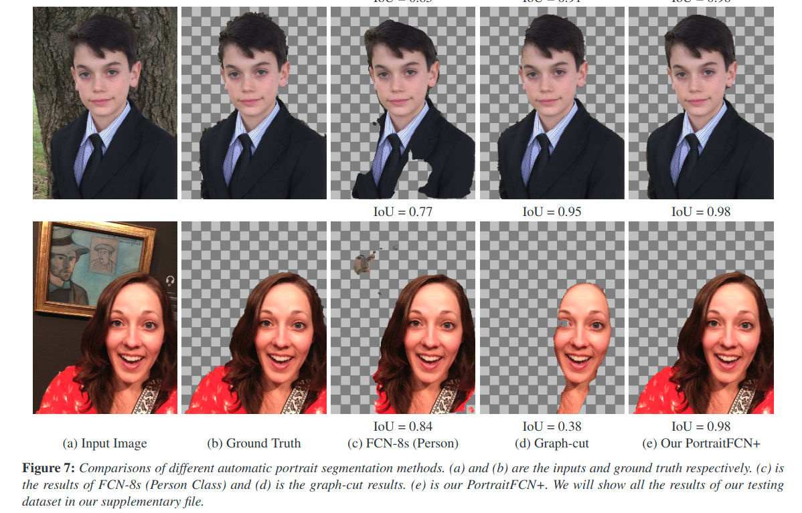

* 项目: <http://xiaoyongshen.me/webpage_portrait/index.html>
* 论文: [Automatic Portrait Segmentation for Image Stylization](http://xiaoyongshen.me/webpage_portrait/papers/portrait_eg16.pdf)
* 下载: Please download from [OneDrive](https://1drv.ms/u/s!ApwdOxIIFBH19TzDv7nRfH5ZsMNL) or [Baiduyun](http://pan.baidu.com/s/1bQ4yHC).

> 肖像画是摄影和绘画的主要艺术形式。在大多数情况下，艺术家试图使主体从周围突出，例如，使其更亮或更锐利。在数字世界中，通过使用适合于图像语义的照相或绘画滤镜处理肖像图像，可以实现类似的效果。虽然存在许多成功的用户指导方法来描绘该主题，但缺乏全自动技术并且产生不令人满意的结果。我们的论文首先通过引入专用于肖像的新自动分割算法来解决这个问题。然后，我们在此结果的基础上，描述了几个利用我们的自动分割算法生成高质量肖像的肖像滤镜。

### Deep Automatic Portrait Matting

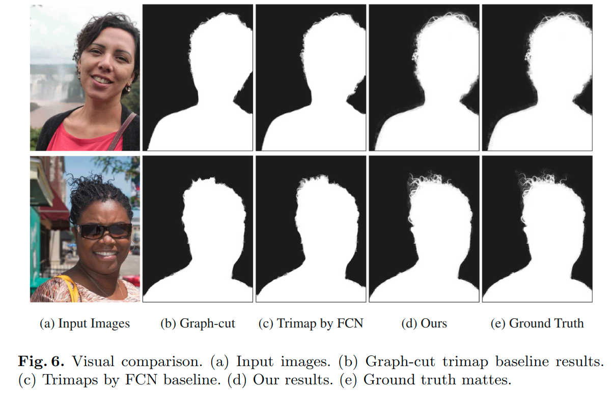

* 论文: <http://www.cse.cuhk.edu.hk/~leojia/projects/automatting/papers/deepmatting.pdf>
* 项目:
    * <http://www.cse.cuhk.edu.hk/~leojia/projects/automatting/>
    * <http://xiaoyongshen.me/webpages/webpage_automatting/>
* 下载:
    * [Data(zip, 1.15GB)] Please send Email to <goodshenxy@gmail.com> to request it.
    * 作者自己公开了: https://1drv.ms/u/s!ApwdOxIIFBH19Ts5EuFd9gVJrKTo

> 我们提出了一种用于性状图像的自动图像matting方法。该方法不需要用户交互，这在大多数先前的方法中是必不可少的。为了实现这一目标，提出了一种新的端到端卷积神经网络（CNN）框架，其采用肖像图像的输入。它输出matting的结果。我们的方法不仅考虑图像语义预测，还考虑像素级图像matte优化。一个新的肖像image dataset与我们标记的matting基础事实构成。我们的自动方法通过最先进的方法获得了可比较的结果，该方法需要指定的前景和背景区域或像素。
>
> 我们从Flickr收集了肖像图像。然后选择它们以确保肖像具有各种年龄，颜色，衣服，配饰，发型，头部位置，背景场景等。matting区域主要是由于景深引起的头发和柔软边缘。裁剪所有图像，使得面部矩形具有相似的尺寸。通过选定的肖像图像，我们创建了具有密集用户交互的alpha matte，以确保它们具有高质量。
>
> 首先，我们标记每个图像放大到局部区域的三元组。
>
> 然后我们计算mattes, 使用闭式matting[1]和KNN matting[2]。
>
> 每个图像的两个计算遮罩覆盖背景图像以手动检查质量。我们为数据集选择更好的一个。如果两个mattes都不符合我们的高标准，结果将被丢弃。必要时，小错误可以通过Photoshop[31]来解决。在此标签处理后，我们收集了2,000张高质量遮罩图像。这些图像被随机分成训练和测试集，分别具有1,700和300个图像。

## Other

### Large-scale Fashion (DeepFashion) Database

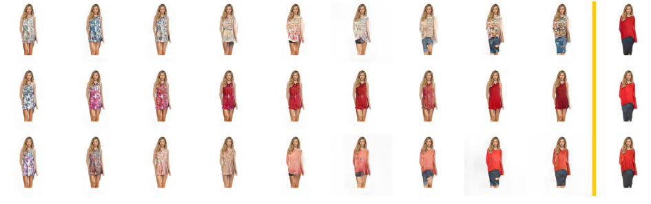

* 项目: <http://mmlab.ie.cuhk.edu.hk/projects/DeepFashion.html>
* 组织:
    * [Multimedia Laboratory](http://mmlab.ie.cuhk.edu.hk/)
    * [The Chinese University of Hong Kong](http://www.cuhk.edu.hk/english/index.html)
* 下载: http://pan.baidu.com/s/1i43pnZR (更多细节请见项目主页)

> 我们提供DeepFashion数据库，这是一个大型服装数据库，它有几个吸引人的特性：
>
> * 首先，DeepFashion包含超过800,000种不同的时尚图像，从精美的商店图像到无约束的消费者照片。
> * 其次，DeepFashion注释了丰富的服装商品信息。此数据集中的每个图像都标有50个类别，1,000个描述性属性，边界框和服装标记。
> * 第三，DeepFashion包含超过300,000个交叉姿势/跨域图像对。使用DeepFashion数据库开发了四个基准，包括属性预测，消费者到商店的衣服检索，店内衣服检索和地标检测。
>
> 这些基准的数据和注释也可以用作以下计算机视觉任务的训练和测试集，例如衣服检测，衣服识别和图像检索。请阅读“下载说明”以访问数据集。

## need your help...

> 有些数据集已经忘记了出处，大家有见过的，希望可以补充下。

* Image Pair
* Cosal2015
* INCT2016
* RGBDCoseg183
* 06RGBDCosal150
* SegTrackV1/V2
* ViSal
* MCL
* UVSD
* VOS

## Reference

### [Salient Object Detection: A Survey](https://arxiv.org/abs/1411.5878)

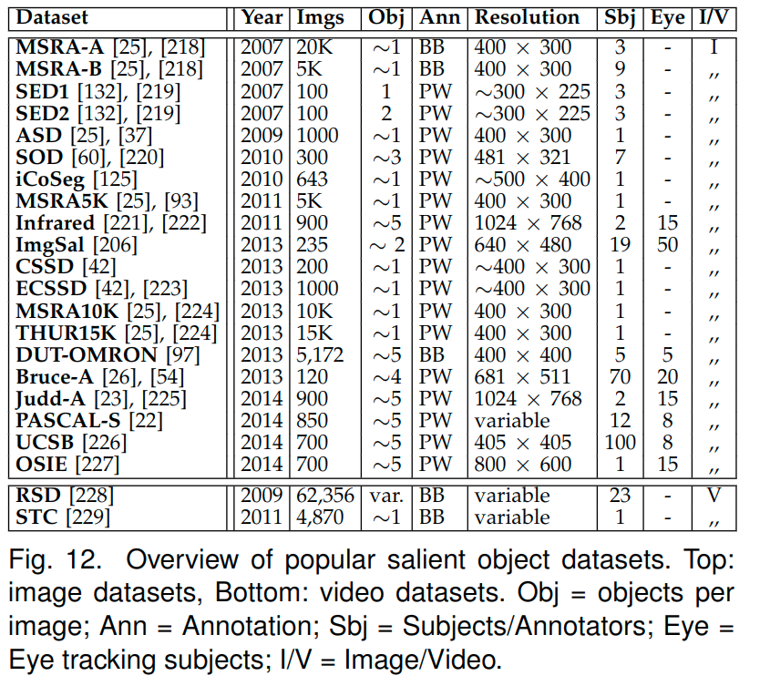

详细评估: <https://mmcheng.net/zh/salobjbenchmark/> (这里展示了{THUR15K, JuddDB, DUT-OMRON, SED2, MSRA10K, ECSSD}六种数据集的一个榜单).

### [Review of Visual Saliency Detection with Comprehensive Information](https://arxiv.org/abs/1803.03391)

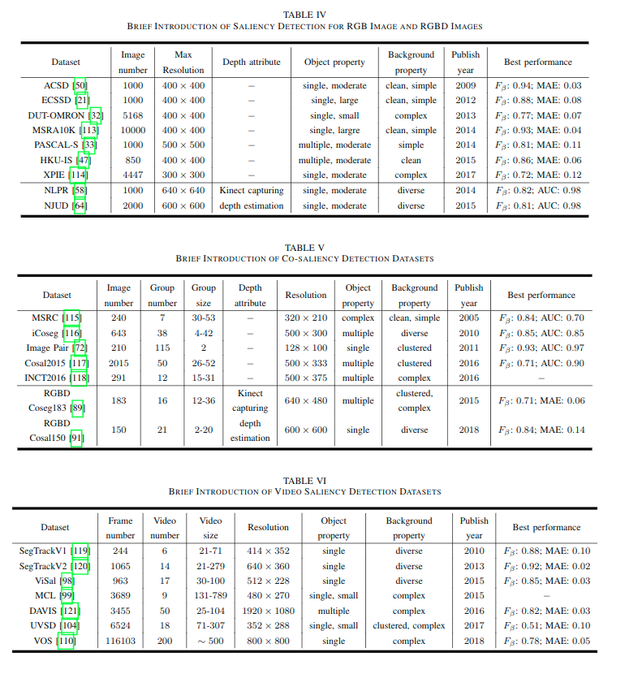

### [Salient Object Detection in the Deep Learning Era: An In-Depth Survey](https://www.researchgate.net/publication/332553805_Salient_Object_Detection_in_the_Deep_Learning_Era_An_In-Depth_Survey)

* 项目：https://github.com/wenguanwang/SODsurvey
* 说明：本文档于2019年07月07日修改的内容主要参考自该综述论文，感谢作者的工作，总结的非常详细！

## More

### Similiar Projects

* [awesome-semantic-segmentation](https://github.com/mrgloom/awesome-semantic-segmentation)

### Research Institutes

* 百度研究院: <https://ai.baidu.com/broad/introduction>
* 中山大学人机物智能融合实验室: <http://www.sysu-hcp.net/resources/>
* 大连理工大学IIAU-LAB: <http://ice.dlut.edu.cn/lu/publications.html>
* CUHK Multimedia Laboratory: <http://mmlab.ie.cuhk.edu.hk/datasets.html>

### Resource Websites

* TC-11 Online Resources: <http://tc11.cvc.uab.es/datasets/type/>
* CVonline: Image Databases: <http://homepages.inf.ed.ac.uk/rbf/CVonline/Imagedbase.htm>
    * 中文: <https://blog.csdn.net/zhaoliang027/article/details/83376167>
* MediaEval Benchmark: <http://www.multimediaeval.org/datasets/>
* Mit Saliency Benchmark: <http://saliency.mit.edu/datasets.html>
* Datasets for machine learning: <https://www.datasetlist.com/>
* UCI machine learning repository:<https://archive.ics.uci.edu/ml/datasets.html>
* Kaggle datasets：<https://www.kaggle.com/datasets>
* Google Dataset Seaerch: <https://toolbox.google.com/datasetsearch>
