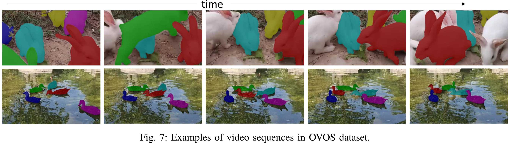

# Another Awesome Dataset List 

| License                                                                                               | Last Commit                                                                                                                     | Issues                                                                                                                | Stars                                                                                                               |
| ----------------------------------------------------------------------------------------------------- | ------------------------------------------------------------------------------------------------------------------------------- | --------------------------------------------------------------------------------------------------------------------- | ------------------------------------------------------------------------------------------------------------------- |
|  |  |  |  |

💖 Some great tools can be found at [resource websites](#resource-websites).

> Please **cite the related paper** if you **use their dataset** 😄
>
> I list some other datasets in the issue [https://github.com/lartpang/awesome-segmentation-saliency-dataset/issues/15](https://github.com/lartpang/awesome-segmentation-saliency-dataset/issues/15). I hope it works for you.

- [Another Awesome Dataset List !Badge](#another-awesome-dataset-list-)
  - [Saliency](#saliency)
    - [RGB Saliency](#rgb-saliency)
      - [MSRA(MSRA10K/MSRA-B)](#msramsra10kmsra-b)
      - [SED1/2](#sed12)
      - [ASD(MSRA1000/MSRA1K)](#asdmsra1000msra1k)
      - [DUT-OMRON](#dut-omron)
      - [DUTS](#duts)
      - [SOC (Salient Objects in Clutter)](#soc-salient-objects-in-clutter)
      - [HKU-IS](#hku-is)
      - [SOD (Salient Object Dataset)](#sod-salient-object-dataset)
      - [Infrared](#infrared)
      - [ImgSal](#imgsal)
      - [ECSSD/CSSD](#ecssdcssd)
      - [THUR15K](#thur15k)
      - [Bruce-A](#bruce-a)
      - [Judd-A](#judd-a)
      - [PASCAL-S](#pascal-s)
      - [UCSB](#ucsb)
      - [OSIE](#osie)
      - [ACSD](#acsd)
    - [RGB-D Saliency](#rgb-d-saliency)
      - [SIP](#sip)
      - [NLPR/RGBD1000](#nlprrgbd1000)
      - [NJU400/2000](#nju4002000)
      - [STEREO/SSB](#stereossb)
      - [LFSD](#lfsd)
      - [RGBD135/DES](#rgbd135des)
      - [DUT-RGBD/DUTLF-Depth](#dut-rgbddutlf-depth)
      - [SSD/SSD100](#ssdssd100)
      - [ReDWeb-S](#redweb-s)
      - [COME15K](#come15k)
    - [RGB-T Saliency](#rgb-t-saliency)
      - [VT723](#vt723)
      - [VT5000](#vt5000)
      - [VT1000](#vt1000)
      - [VT821](#vt821)
    - [COD (Camouflaged Object Detection)](#cod-camouflaged-object-detection)
      - [NC4K](#nc4k)
      - [COD10K](#cod10k)
      - [CAMO](#camo)
      - [CHAMELEON](#chameleon)
      - [CPD1K: Camouflaged People Dataset](#cpd1k-camouflaged-people-dataset)
      - [MoCA-Mask](#moca-mask)
    - [Dichotomous Image Segmentation](#dichotomous-image-segmentation)
      - [DIS5K](#dis5k)
    - [High-Resolution Saliency](#high-resolution-saliency)
      - [HRSOD/DAVIS-S](#hrsoddavis-s)
    - [Co-Saliency](#co-saliency)
      - [ImagePair](#imagepair)
      - [MSRC](#msrc)
      - [WICOS](#wicos)
      - [iCoSeg](#icoseg)
      - [CoCA: Common Category Aggregation (CoCA) dataset](#coca-common-category-aggregation-coca-dataset)
      - [CoSal2015](#cosal2015)
      - [CoSOD3k](#cosod3k)
      - [RGBDCosal150](#RGBDCosal150)
      - [RGBDCoseg183](#RGBDCoseg183)
      - [INCT2016](#INCT2016)
    - [Video Saliency](#video-saliency)
      - [RSD(PKU-RSD)](#rsdpku-rsd)
      - [STC](#stc)
    - [Other](#other)
      - [XPIE](#xpie)
      - [SOS](#sos)
      - [MSO](#mso)
      - [ILSO-1K/2K](#ilso-1k2k)
      - [HS-SOD](#hs-sod)
      - [KAIST Salient Pedestrian Dataset](#kaist-salient-pedestrian-dataset)
      - [Grayscale-Thermal Foreground Detection Dataset](#grayscale-thermal-foreground-detection-dataset)
  - [Segmentation](#segmentation)
    - [VOS (Video Object Segmentation)](#vos-video-object-segmentation)
      - [DAVIS](#davis)
      - [TAO-VOS](#tao-vos)
      - [OVOS](#ovos)
    - [Image Segmentation](#image-segmentation)
      - [aNYU](#anyu)
      - [Supervisely人像数据集](#supervisely人像数据集)
      - [Clothing Parsing](#clothing-parsing)
      - [HumanParsing-Dataset](#humanparsing-dataset)
      - [Look into Person (LIP)](#look-into-person-lip)
      - [Taobao Commodity Dataset (TCD)](#taobao-commodity-dataset-tcd)
      - [Object Extraction Dataset](#object-extraction-dataset)
      - [Clothing Co-Parsing (CCP) Dataset](#clothing-co-parsing-ccp-dataset)
      - [People segmentation dataset](#people-segmentation-dataset)
  - [AD (Anomaly Detection)](#ad-anomaly-detection)
    - [MVTec AD](#mvtec-ad)
    - [MPDD](#mpdd)
  - [Matting](#matting)
    - [alphamatting.com](#alphamattingcom)
    - [Composition-1k: Deep Image Matting](#composition-1k-deep-image-matting)
    - [Semantic Human Matting](#semantic-human-matting)
    - [Matting-Human-Datasets](#matting-human-datasets)
    - [PFCN](#pfcn)
    - [Deep Automatic Portrait Matting](#deep-automatic-portrait-matting)
  - [Other](#other-1)
    - [Large-scale Fashion (DeepFashion) Database](#large-scale-fashion-deepfashion-database)
    - [Tencent ML-Images](#tencent-ml-images)
  - [need your help...](#need-your-help)
  - [Reference](#reference)
    - [Survey](#survey)
    - [Project](#project)
  - [More](#more)
    - [Similiar Projects](#similiar-projects)
    - [Research Institutes](#research-institutes)
    - [Resource Websites](#resource-websites)

## Saliency

### RGB Saliency

#### MSRA(MSRA10K/MSRA-B)

* Paper: [T. Liu, J. Sun, N. Zheng, X. Tang, and H.-Y. Shum, "Learningto detect a salient object, " inCVPR, 2007, pp.1–8](http://mmlab.ie.cuhk.edu.hk/2007/CVPR07_detect.pdf)
* 主页: 南开大学媒体计算实验室: [https://mmcheng.net/zh/msra10k/](https://mmcheng.net/zh/msra10k/)
* Download:
  + MSRA10K(formally named as THUS10000; [195MB](http://mftp.mmcheng.net/Data/MSRA10K_Imgs_GT.zip): images + binary masks):
    - Pixel accurate salient object labeling for **10000 images** from MSRA dataset.
    - Please cite our paper [https://mmcheng.net/SalObj/] if you use it.
    - Saliency maps and salient object region segmentation for other 20+ alternative methods are also available ([百度网盘](http://pan.baidu.com/s/1dEaQqlF#path=%252FShare%252FSalObjRes)).
  + MSRA-B ([111MB](http://mftp.mmcheng.net/Data/MSRA-B.zip): images + binary masks):
    - Pixel accurate salient object labeling for **5000 images** from MSRA-B dataset.
    - Please cite the corresponding paper [https://mmcheng.net/drfi/] if you use it.

我们通过检测输入图像中的显着对象来研究视觉注意力. 我们将显着对象检测表示为图像分割问题, 我们将显着对象与图像背景分开. 我们提出了一系列新颖的特征, 包括多尺度对比度, 中心环绕直方图和颜色空间分布, 以在本地, 区域和全局描述显着对象. 学习条件随机场以有效地组合这些特征以用于显着对象检测. 我们还构建了一个**包含由多个用户标记的数以万计的完全标记图像的图像数据库**. 据我们所知, 它是第一个用于视觉注意算法定量评估的大型图像数据库. 我们在此图像数据库上验证了我们的方法, 该数据库在本文中是公开的.

人们可能对图像中的显着对象有不同的看法. 为了解决"给定图像中可能是什么样的显着对象"的问题, 我们通过在多个用户的图像中标记"基础事实"显着对象来进行投票策略. 在本文中, 我们关注图像中单个显着对象的情况. 显著性对象表示. 通常, 我们**将给定对象表示为给定image I中的二元mask** $A={a_x}$. 对于每个像素x, $a_x∈{1, 0}$是二进制标签, 以指示像素是否属于显着对象.**为了标记和评估, 我们要求用户绘制一个矩形来指定一个显着对象. 我们的检测算法也输出一个矩形.**

图像来源. 我们收集了一个非常大的图像数据库, 其中130, 099个来自各种来源的高质量图像, 主要来自图像论坛和图像搜索引擎. 然后我们手动选择60, 000多个图像, 每个图像包含一个显着对象或一个独特的前景对象. 我们进一步选择了20, 840张图片进行标记. 在选择过程中, 我们**排除了包含非常大的显着对象的任何图像**, 从而可以更准确地评估检测的性能.

标记一致性. 对于每个要标记的图像, 我们请用户绘制一个矩形, 该矩形包围图像中最大的对象根据他/她自己的理解. 由不同用户标记的矩形通常不相同. 为了减少标签的不一致性, 我们从多个用户绘制的矩形中选择一个"真实"标签.

#### SED1/2

| 数据类型                                           | 示例                                   |
| -------------------------------------------------- | -------------------------------------- |
| 单目标                                             |  |
| 双目标                                             |  |
| 真值给出的是每个图像由三个不同的人类对象分割的结果 |  |

* [A. Borji, M.-M. Cheng, H. Jiang, and J. Li, "Salient objectdetection: A benchmark, "IEEE TIP, vol.24, no.12, pp.5706–5722, 2015.](https://arxiv.org/abs/1501.02741)
* [Image Segmentation by Probabilistic Bottom-Up Aggregation and Cue Integration](http://www.wisdom.weizmann.ac.il/~meirav/Segmentation_Alpert_Galun_Brandt_Basri.pdf)
* Project: [http://www.wisdom.weizmann.ac.il/~vision/Seg_Evaluation_DB/index.html](http://www.wisdom.weizmann.ac.il/~vision/Seg_Evaluation_DB/index.html)
* Download: [http://www.wisdom.weizmann.ac.il/~vision/Seg_Evaluation_DB/dl.html](http://www.wisdom.weizmann.ac.il/~vision/Seg_Evaluation_DB/dl.html)

这项工作的目的是为图像分割研究提供经验和科学依据. 评估分割算法产生的结果具有挑战性, 因为很难提出提供基础真实分割的规范测试集. 这部分是因为在日常复杂图像中手动描绘片段可能是费力的. 此外, 人们往往倾向于将语义考虑纳入其分段中, 这超出了数据驱动的分割算法的范围. 因此, 许多现有算法仅显示很少的分割结果. 为了评估由不同算法产生的分割, 我们编制了一个数据库, 目前**包含200个灰度图像以及真实标注分割**. 该数据库专门设计用于避免潜在的模糊, 仅通过仅通过强度, 纹理或其他低水平线索合并清晰描绘前景中与其周围环境不同的一个或两个物体的图像. 通过要求人类对象手动地将灰度图像(还提供颜色源)分成两个或三个类别来获得地面真实分割, 其中**每个图像由三个不同的人类对象分割**. 通过评估其与真实分割的一致性及其碎片量来评估分割. 与此数据库评估一起, 我们提供了用于评估给定分割算法的代码. 这样, 不同的分割算法可能具有可比较的结果以获得更多细节, 请参阅"评估测试"部分.

#### ASD(MSRA1000/MSRA1K)

* Paper: [A two-stage approach to saliency detection inimages](https://www.researchgate.net/publication/224312323_A_two-stage_approach_to_saliency_detection_in_images)
* 相关:
  + T. Liu, J. Sun, N.-N. Zheng, X. Tang, and H.-Y. Shum, "[Learning to detect a salient object](http://research.microsoft.com/en-us/um/people/jiansun/salientobject/salient_object.htm), " in *Proc. IEEE Conf. Comput. Vis. Pattern Recognit.*, 2007, pp.1–8.
  + R. Achanta, S. Hemami, F. Estrada, and S. Süsstrunk, "[Frequency-tuned salient region detection](http://ivrlwww.epfl.ch/supplementary_material/RK_CVPR09/), " in *Proc. IEEE Conf. Comput. Vis. Pattern Recognit.*, 2009, pp.1597–1604.
* Download: [http://download.csdn.net/detail/wanyq07/9839322](http://download.csdn.net/detail/wanyq07/9839322)
  + 关于Download的说明: 因为基于MSRA的图片数据集, 在孙剑走了之后, MARA上就没了他的页面, 相关的资源也就找不到了. CSDN一篇博客有分享. 原图Download地址:[MSRA图像数据集(1000幅含真实标注)](http://download.csdn.net/detail/tuconghuan/8357509). 上面Download到的标注图尺寸被统一改为512*512, 所以这里给个地址:[ASD尺寸一致](http://download.csdn.net/detail/zzb4702/9559378)

ASD contains 1, 000 images with pixel-wise ground-truths. The images are selected from the MSRA-A dataset, where only the bounding boxes around salient regions are provided. The accurate salient masks in ASD are created based on object contours.

这个数据集包含有1000张图(MSRA1000)这个数据库来自于 该数据库的说明以及一些算法(IT, MZ, GB, SR, AC, IG ) 的结果可以在[Frequency-tuned Salient Region Detection](http://ivrlwww.epfl.ch/supplementary_material/RK_CVPR09/index.html) (FT算法 => 这里改进的数据集叫做ACSD, 相关可见[ACSD](#ACSD), 此外其中还包含了这1000张测试图的真值图.

#### DUT-OMRON

* Paper: C. Yang, L. Zhang, H. Lu, X. Ruan, and M.-H. Yang, "[Saliency detection via graph-based manifold ranking](http://saliencydetection.net/dut-omron/), " in *Proc. IEEE Conf. Comput. Vis. Pattern Recognit.*, 2013, pp.3166–3173.
* Project: [http://saliencydetection.net/dut-omron/#outline-container-org0e04792](http://saliencydetection.net/dut-omron/#outline-container-org0e04792)
* Download: [http://saliencydetection.net/dut-omron/download/DUT-OMRON-image.zip](http://saliencydetection.net/dut-omron/download/DUT-OMRON-image.zip)

数据库包括从超过140, 000张图像中手动选择的5, 168个高质量图像. 我们将图像的大小调整为宽为400或高为400像素, 其中另一条边小于400. 我们数据库的图像具有一个或多个显着对象和相对复杂的背景. 我们共有25名参与者, 用于汇总真值, 每个图像有五个参与者标签. 他们都有正常或矫正到正常的视力并且意识到我们实验的目标. 我们为提出的数据库构建像素方面的真实标注, 边界框, 和眼睛固定标注真值.

我们的数据集是唯一一个具有眼睛固定, 边界框和像素方面的大规模真实标注的数据集. 与ASD和MSRA数据集以及其他一些眼睛固定数据集(即MIT和NUSEF数据集)相比, 数据集中的图像更加困难, 因此更具挑战性, 并为相关的显着性研究提供了更多的改进空间.

#### DUTS

* Project: [http://saliencydetection.net/duts/](http://saliencydetection.net/duts/)

We contribute a large scale data set named DUTS, **containing 10, 553 training images and 5, 019 test images**. All training images are collected from the ImageNet DET training/val sets, while test images are collected from the ImageNet DET test set and the SUN data set.
Both the training and test set contain very challenging scenarios for saliency detection. Accurate pixel-level ground truths are manually annotated by 50 subjects.
To our knowledge, DUTS is currently **the largest saliency detection benchmark** with the explicit training/test evaluation protocol.
For fair comparison in the future research, the training set of DUTS serves as a good candidate for learning DNNs, while the test set and other public data sets can be used for evaluation.

#### SOC (Salient Objects in Clutter)

* Paper: [Salient Objects in Clutter](https://arxiv.org/abs/2105.03053)
  * Chinese Version: [https://dengpingfan.github.io/papers/[2022][TPAMI]SOC_Chinese.pdf](https://dengpingfan.github.io/papers/%5B2022%5D%5BTPAMI%5DSOC_Chinese.pdf)
* Project:
  * [https://github.com/DengPingFan/SOC-DataAug](https://github.com/DengPingFan/SOC-DataAug)
  * [https://mmcheng.net/socbenchmark/](https://mmcheng.net/socbenchmark/)
* Download: See [https://mmcheng.net/socbenchmark/](https://mmcheng.net/socbenchmark/)

We propose a new high-quality dataset and update the previous saliency benchmark. Specifically, our dataset called SOC, Salient Objects in Clutter, includes images with salient and non-salient objects from daily object categories. Beyond object category annotations, each salient image is accompanied by attributes (e.g., appearance change, clutter) that reflect common challenges in real-world scenes, and can help 1) gain a deeper insight into the SOD problem, 2) investigate the pros and cons of the SOD models, and 3) objectively assess models from different perspectives. Finally, we report attribute-based performance assessment on our SOC dataset. We believe that our dataset and results will open new directions for future research on salient object detection.

SOC has 6,000 images with 80 common categories. Half of the images contain salient objects and the others contain none.**Each salient-object-contained image is annotated with instance-level SOD ground-truth, object category (e.g., dog, book), and challenging factors** (e.g., big/small object).**The non-salient object subset has 783 texture images and 2, 217 real-scene images** (e.g., aurora, sky).

#### HKU-IS

* Project: [https://i.cs.hku.hk/~gbli/deep_saliency.html](https://i.cs.hku.hk/~gbli/deep_saliency.html)
* Paper: [Visual Saliency Based on Multiscale Deep Features](http://i.cs.hku.hk/~yzyu/publication/mdfsaliency-cvpr15.pdf)
* Download:
  + [Google Drive](https://drive.google.com/open?id=0BxNhBO0S5JCRQ1N6V25VeVh6cHc&authuser=0)
  + [Baidu Yun](http://pan.baidu.com/s/1c0EpNfM)

数据集包含4447个具有显着对象的像素注释的图像
视觉显着性是包括计算机视觉在内的认知和计算科学中的一个基本问题. 在本文中, 我们发现可以从使用深度卷积神经网络(CNN)提取的多尺度特征中学习高质量的视觉显着性模型. 视觉识别任务的成功. 为了学习这样的显着性模型, 我们引入了一种神经网络结构, 它在CNN顶部具有完全连接的层, 负责三个不同尺度的特征提取. 然后, 我们提出一种改进方法来增强我们的显着性结果的空间一致性. 最后, 针对不同级别的图像分割计算的聚合多个显着性图可以进一步提高性能, 从而产生比由单个分割产生的显着性图更好的显着性图. 为了促进对视觉显着性模型的进一步研究和评估, **我们还构建了一个新的大型数据库, 包括4447个具有挑战性的图像及其像素显着性注释**.

#### SOD (Salient Object Dataset)

* Project: [http://elderlab.yorku.ca/SOD/](http://elderlab.yorku.ca/SOD/)
* Download
  + 官方: [http://elderlab.yorku.ca/SOD/SOD.zip](http://elderlab.yorku.ca/SOD/SOD.zip)
  + 百度云: [https://pan.baidu.com/s/1IMElTPwD4yTo2TMSRU-keQ](https://pan.baidu.com/s/1IMElTPwD4yTo2TMSRU-keQ)

此数据集是基于Berkeley Segmentation Dataset(BSD)的显着对象边界的集合. 要求七个对象选择BSD中使用的每个图像中的显着对象. 每个主题随机显示伯克利分割数据集的子集, 作为在相应图像上重叠的边界. 然后, 可以通过单击选择哪些区域或区段对应于显着对象.
对于BSD中使用的300个图像的每个图像, 都有一个.mat文件可以由Matlab打开. 加载每个mat文件会将一个名为"SES"的结构读入内存, 该结构是从SOD中每个主题的会话中收集的数据数组.

💝 The original images are available from the Berkely Segmentation Dataset at: [http://www.eecs.berkeley.edu/Research/Projects/CS/vision/grouping/segbench/](http://www.eecs.berkeley.edu/Research/Projects/CS/vision/grouping/segbench/)

#### Infrared

* Project: [https://ivrl.epfl.ch/research-2/research-downloads/supplementary_material-cvpr11-index-html/](https://ivrl.epfl.ch/research-2/research-downloads/supplementary_material-cvpr11-index-html/)
* Paper: [http://infoscience.epfl.ch/record/167478](http://infoscience.epfl.ch/record/167478)
* Download: [http://ivrgwww.epfl.ch/supplementary_material/cvpr11/nirscene1.zip](http://ivrgwww.epfl.ch/supplementary_material/cvpr11/nirscene1.zip)

我们使用对传统SLR相机的简单修改来捕获数百个彩色(RGB)和近红外(NIR)场景的图像. 我们表明, 近红外信息的添加导致场景识别任务中的性能显着提高, 并且当使用适当的4维颜色表示时, 改进仍然更大. 特别地, 我们提出了MSIFT-一种多光谱SIFT描述符, 当与基于内核的分类器结合时, 超过了现有技术的场景识别技术(例如GIST)及其多光谱扩展的性能. 我们使用数百个RGB-NIR场景图像的新数据集对我们的算法进行了广泛的测试, 并对Torralba的场景分类数据集进行了基准测试.

#### ImgSal

* Project: [https://sites.google.com/site/jianlinudt/saliency-database](https://sites.google.com/site/jianlinudt/saliency-database)
* 作者主页: [http://www.escience.cn/people/jianli/DataBase.html](http://www.escience.cn/people/jianli/DataBase.html)

数据库的特点

1. 235个彩色图像的集合, 分为六个不同的类别;
2. 提供人类固定记录(扫视数据)和人类标记结果;
3. 易于使用.

我们将同时考虑不同大小的显着区域的检测. 实际上, 可接受的显着性检测器应该检测大的和小的显着区域. 此外, 显着性检测还应该定位杂乱背景中的显着区域和具有重复干扰物的区域. 我们还注意到, 对于任何显着性检测器, 不同的图像呈现不同的难度. 但是, 现有的显着性基准(例如Bruce的数据集, Hou'dataset, Harel的数据集等)是图像集合, 没有尝试对所需分析的难度进行分类. 因此, 我们为显着性模型验证创建了一个新的显着性基准. 该数据库提供REGION基础事实(人类标记)和FIXATION基础事实(通过眼动仪).
图像集使用Google以及参考最近的文献收集了包含235张图像的数据库. 此数据库中的图像为480 x 640像素, 分为6类: 1)50个具有大显着区域的图像; 2)具有中间显着区域的80幅图像; 3)具有小显着区域的60幅图像; 4)背景杂乱的15幅图像; 5)带有重复干扰物的15张图像; 6)具有大和小显着区域的15个图像.

#### ECSSD/CSSD

* Download: [http://www.cse.cuhk.edu.hk/leojia/projects/hsaliency/dataset.html](http://www.cse.cuhk.edu.hk/leojia/projects/hsaliency/dataset.html)
  + ECSSD (1000 images)
    - [ECSSD images (64.6MB)](http://www.cse.cuhk.edu.hk/leojia/projects/hsaliency/data/ECSSD/images.zip)
    - [ECSSD ground truth masks (1.78MB)](http://www.cse.cuhk.edu.hk/leojia/projects/hsaliency/data/ECSSD/ground_truth_mask.zip) (Updated on 9 April, 2015)
  + CSSD (200 images)
    - [CSSD images (18.7MB)](http://www.cse.cuhk.edu.hk/leojia/projects/hsaliency/data/CSSD/images.zip)
    - [CSSD groud truth masks (0.75MB)](http://www.cse.cuhk.edu.hk/leojia/projects/hsaliency/data/CSSD/ground_truth_mask.zip)

其中CSSD包含了200张图, 而ECSSD是前者的扩展集包含有1000张图

虽然MSRA-1000的图像内容种类繁多, 但背景结构主要是简单而流畅. 为了表示自然图像通常落入的情况, 我们将复杂场景显着性数据集(CSSD)扩展到包含1000个图像的更大数据集(ECSSD), 其中包含许多语义上有意义但结构复杂的图像用于评估. 这些图像是从互联网上获取的, 并要求5名助手制作地面真相面具. 上面显示了几个带有相应掩模的例子.

#### THUR15K

* Paper: [https://mmcheng.net/zh/gsal/](https://mmcheng.net/zh/gsal/)
* Download: [https://mmcheng.net/mftp/Data/THUR15000.zip](https://mmcheng.net/mftp/Data/THUR15000.zip)
  + 百度云: [https://pan.baidu.com/s/1u-E-8ujnxBz0mdmXsJglvg](https://pan.baidu.com/s/1u-E-8ujnxBz0mdmXsJglvg)

有效识别大型图像集中的显着对象对于许多应用是必不可少的, 包括图像检索, 监视, 图像注释和对象识别. 我们提出了一种简单, 快速, 有效的算法, 通过分析图像集合来定位和分割显着对象. 作为一个关键的新颖性, 我们通过提取最大化图像间相似性和图像内清晰度的显着对象(在预过滤图像的集合中)来引入群体显着性以实现优越的无监督显着对象分割. 为了评估我们的方法, 我们构建了一个大型基准数据集, **该数据集包含多个类别的15K图像, 适用于显着对象区域的6000多个像素精确的地面实况注释**. 在我们的所有测试中, group saliency 始终优于最先进的单图像显着性算法, 从而实现更高的精度和更好的回忆. 我们的算法成功处理了比任何现有基准数据集更大的订单的图像集合, 包括来自各种网络间源的各种异构图像.
我们引入了分类图像的标记数据集, 用于评估基于草图的图像检索. 我们为5个关键字中的每一个Download了大约3000张图像:"蝴蝶", "咖啡杯", "狗跳", "长颈鹿"和"平面", 一起包括大约15000张图像.**对于每个图像, 如果存在具有与查询关键字匹配的正确内容的非模糊对象并且对象的大部分可见, 则我们标记这样的对象区域. 与MSRA10K类似, 显着区域以像素级别标记. 我们只标记几乎完全可见的对象的显着对象区域, 因为部分遮挡的对象对形状匹配不太有用. 与MSRA10K不同, THUR15K数据集不包含为数据集中的每个图像标记的显着区域, 即, 一些图像可能没有任何显着区域. 该数据集用于评估基于形状的图像检索性能.**

#### Bruce-A

* Paper: [https://papers.nips.cc/paper/2830-saliency-based-on-information-maximization.pdf](https://papers.nips.cc/paper/2830-saliency-based-on-information-maximization.pdf)

#### Judd-A

* Paper: [http://people.csail.mit.edu/torralba/publications/wherepeoplelook.pdf](http://people.csail.mit.edu/torralba/publications/wherepeoplelook.pdf)

#### PASCAL-S

* Project:
  + [https://ccvl.jhu.edu/datasets/](https://ccvl.jhu.edu/datasets/)
  + [http://www.cbi.gatech.edu/salobj/](http://www.cbi.gatech.edu/salobj/)
* Download:
  + 百度云盘: [https://pan.baidu.com/s/1DZcfwCYdeMW4EGawhXQyig](https://pan.baidu.com/s/1DZcfwCYdeMW4EGawhXQyig)
  + 页面: [http://academictorrents.com/details/6c49defd6f0e417c039637475cde638d1363037e](http://academictorrents.com/details/6c49defd6f0e417c039637475cde638d1363037e)

对来自PASCAL VOC的850张图像子集的自由修复. 收集8个主题, 3s观看时间, Eyelink II眼动仪. 大多数算法的性能表明PASCAL-S比大多数显着性数据集偏差更小.

💔 由于其标注的真值有多个值, 常见的做法是使用 `255/2` 值作为阈值进行处理后, 再使用该数据集

#### UCSB

* Paper: [https://www.ncbi.nlm.nih.gov/pmc/articles/PMC3954044/](https://www.ncbi.nlm.nih.gov/pmc/articles/PMC3954044/)
* Download: [https://labs.psych.ucsb.edu/eckstein/miguel/research_pages/saliencydata.html](https://labs.psych.ucsb.edu/eckstein/miguel/research_pages/saliencydata.html)

#### OSIE

* Paper: [https://jov.arvojournals.org/article.aspx?articleid=2193943](https://jov.arvojournals.org/article.aspx?articleid=2193943)

大量先前的模型用于预测人们在自然场景中的外观, 侧重于像素级图像属性. 为了弥合计算显着性模型的预测能力与人类行为之间的语义差距, 我们提出了一种新的显着性体系结构, 它将信息分为三个层次: 像素级图像属性, 对象级属性和语义级属性. 通常忽略对象和语义级别信息, 或者仅讨论少数样本对象类别, 其中缩放到大量对象类别是不可行的, 也不是神经合理的. 为了解决这个问题, 这项工作构建了一个基本属性的原则词汇表来描述对象和语义级信息, 从而不限制有限数量的对象类别. 我们**建立了一个包含500个图像的新数据集, 其中包含15个观察者的眼动追踪数据和5, 551个具有精细轮廓和12个语义属性的分段对象的注释数据**(可在论文中公开获得). 实验结果证明了对象和语义级信息在预测视觉注意力方面的重要性.

#### ACSD

* Paper: [Frequency-tuned salient region detection](https://infoscience.epfl.ch/record/135217/files/1708.pdf)
* Project: [https://ivrl.epfl.ch/research-2/research-current/research-saliency/supplementary_material-rk_cvpr09-index-html/](https://ivrl.epfl.ch/research-2/research-current/research-saliency/supplementary_material-rk_cvpr09-index-html/)
* Download: [Only GT](https://ivrl.epfl.ch/wp-content/uploads/2018/08/binarymasks.zip)

基于ASD数据集(MSRA1K)制作.
我们从[Z. Wang and B. Li. A two-stage approach to saliency detection in images. ICASSP 2008.]中提出的1000个图像中获得了一个真实数据库. [Z. Wang and B. Li. A two-stage approach to saliency detection in images. ICASSP 2008.]中的基本事实是在显着区域周围的用户绘制的矩形. 这是不准确的, 并将多个对象合二为一. 我们手动分割用户绘制的矩形内的显着对象以获得二进制掩码, 如下所示. 这样的掩膜既准确又允许我们清楚地处理多个显着对象.

### RGB-D Saliency

Thanks:

* @JXingZhao: [https://github.com/JXingZhao/ContrastPrior](https://github.com/JXingZhao/ContrastPrior)
* @jiwei0921: [https://github.com/jiwei0921/RGBD-SOD-datasets](https://github.com/jiwei0921/RGBD-SOD-datasets)
* More Details can be found at: [http://dpfan.net/d3netbenchmark/](http://dpfan.net/d3netbenchmark/)

#### SIP

* Paper: Rethinking RGB-D Salient Object Detection: Models, Datasets, and Large-Scale Benchmarks:https://arxiv.org/pdf/1907.06781.pdf
* Project: [http://dpfan.net/d3netbenchmark/](http://dpfan.net/d3netbenchmark/)
* Download: See [http://dpfan.net/d3netbenchmark/](http://dpfan.net/d3netbenchmark/)

We carefully collect a new salient person (SIP) dataset, which consists of 1K high-resolution images that cover diverse real-world scenes from various viewpoints, poses, occlusion, illumination, and background.

#### NLPR/RGBD1000

* Paper: [Rgbd salient object detection: a benchmark and algorithms](https://docs.google.com/uc?authuser=0&id=0B1wzzt1_uP1rb250d0t6dVFXWG8&export=download)
* Project: [https://sites.google.com/site/rgbdsaliency/home](https://sites.google.com/site/rgbdsaliency/home)
* Download: [https://sites.google.com/site/rgbdsaliency/dataset](https://sites.google.com/site/rgbdsaliency/dataset)

NLPR is also called RGBD1000 dataset which including 1,000 images. There may exist multiple salient objects in each image. The structured light depth images are obtained by the Microsoft Kinect under different illumination conditions.

#### NJU400/2000

* Paper:

  + NJU400: [Depth saliency based on anisotropic center-surround difference](http://mcg.nju.edu.cn/publication/2014/icip14-jur.pdf)
  + NJU2000: [Depth-aware salient object detection using anisotropic center-surround difference](http://mcg.nju.edu.cn/publication/2015/spic15-jur.pdf)
* Project:

  * [MGG](http://mcg.nju.edu.cn/index.html)
  * [http://mcg.nju.edu.cn/publication/2014/icip14-jur/index.html](http://mcg.nju.edu.cn/publication/2014/icip14-jur/index.html)
* Download:

  * Official:
    + [http://mcg.nju.edu.cn/resource.html](http://mcg.nju.edu.cn/resource.html)
    + [http://mcg.nju.edu.cn/dataset/nju400.zip](http://mcg.nju.edu.cn/dataset/nju400.zip)
    + [http://mcg.nju.edu.cn/dataset/nju2000.zip](http://mcg.nju.edu.cn/dataset/nju2000.zip)

  + See [http://dpfan.net/d3netbenchmark/](http://dpfan.net/d3netbenchmark/)

NJU2000 contains 2003 stereo image pairs with diverse objects and complex, challenging scenarios, along with ground-truth map. The stereo images are gathered from 3D movies, the Internet, and photographs taken by a Fuji W3 stereo camera.

#### STEREO/SSB

* Paper: [Leveraging stereopsis for saliency analysis](http://web.cecs.pdx.edu/~fliu/papers/cvpr2012.pdf)
* Project: [http://web.cecs.pdx.edu/~fliu/](http://web.cecs.pdx.edu/~fliu/)
* Download: See [http://dpfan.net/d3netbenchmark/](http://dpfan.net/d3netbenchmark/)

SSB is also called STEREO dataset, which consists of 1000 pairs of binocular images.

#### LFSD

* Paper: [Saliency Detection on Light Field](https://ieeexplore.ieee.org/document/7570181)
* Project: [https://sites.duke.edu/nianyi/publication/saliency-detection-on-light-field/](https://sites.duke.edu/nianyi/publication/saliency-detection-on-light-field/)
* Download:
  * Official: See [https://sites.duke.edu/nianyi/publication/saliency-detection-on-light-field/](https://sites.duke.edu/nianyi/publication/saliency-detection-on-light-field/)
  * See [http://dpfan.net/d3netbenchmark/](http://dpfan.net/d3netbenchmark/)

We acquire 100 light fields using the Lytro light field camera. For each light field, we provide: (a) Raw light field data, (b) A rough focal stack  (c) An all-focus image deriving from focal stack  (d) The ground truth corresponding to all-focus image.

To get a valid ground-truth, we ask three individuals to manually segment the saliency regions from the all-focus image. The result are deemed ground truth only when all three results are consistent (i.e., they have an overlap of over 90%)

#### RGBD135/DES

* Paper: [Depth Enhanced Saliency Detection Method](https://dl.acm.org/doi/pdf/10.1145/2632856.2632866)
* Project: [https://github.com/HzFu/DES_code](https://github.com/HzFu/DES_code)
* Download:

  * Official:
    + Baidu Pan: [https://pan.baidu.com/s/1pLv2B8n](https://pan.baidu.com/s/1pLv2B8n)
    + Google Drive: [https://onedrive.live.com/redir?resid=F3A8A31ABFAC51B0!256&authkey=!AC4-yOEjn0bgrCQ&ithint=file%2crar](https://onedrive.live.com/redir?resid=F3A8A31ABFAC51B0!256&authkey=!AC4-yOEjn0bgrCQ&ithint=file%2Crar)

  + See [http://dpfan.net/d3netbenchmark/](http://dpfan.net/d3netbenchmark/)

In our experiments, we provide a new RGB-D saliency detection dataset. We take 135 RGB-D indoor images by Kinect with the resolution 640×480. Then, three users are asked to mark the salient object of each image. We employ the overlapping areas of the manually labelled object as the ground truth.

#### DUT-RGBD/DUTLF-Depth

* Paper: [Depth-induced Multi-scale Recurrent Attention Network for Saliency Detection](https://openaccess.thecvf.com/content_ICCV_2019/papers/Piao_Depth-Induced_Multi-Scale_Recurrent_Attention_Network_for_Saliency_Detection_ICCV_2019_paper.pdf)
* Project: [https://github.com/jiwei0921/DMRA_RGBD-SOD](https://github.com/jiwei0921/DMRA_RGBD-SOD)
* Download:
  * Official: [https://pan.baidu.com/s/1FwUFmNBox_gMZ0CVjby2dg](https://pan.baidu.com/s/1FwUFmNBox_gMZ0CVjby2dg)
  * See [http://dpfan.net/d3netbenchmark/](http://dpfan.net/d3netbenchmark/)

The dataset is part of DUTLF dataset captured by Lytro camera, and we selected a more accurate 1200 depth map pairs for more accurate RGB-D saliency detection.
We create a large scale RGB-D dataset(DUTLF-Depth) with 1200 paired images containing more complex scenarios, such as multiple or transparent objects, similar foreground and background, complex background, low-intensity environment. This challenging dataset can contribute to comprehensively evaluating saliency models.
And we split the dataset including 800 training set and 400 test set.

#### SSD/SSD100

* Paper: [A Three-Pathway Psychobiological Framework of Salient Object Detection Using Stereoscopic Technology](https://ieeexplore.ieee.org/stamp/stamp.jsp?tp=&arnumber=8265566)
* Download: See [http://dpfan.net/d3netbenchmark/](http://dpfan.net/d3netbenchmark/)

Our SSD100 dataset is built on three stereo movies. The movies contain both the indoors and outdoors scenes. We pick up one stereo image pair at each hundred frames. It totally has tens of thousands of stereo image pairs. We make the image acquisition and image annotation independent to each other, we can avoid dataset design bias, namely a specific type of bias that is caused by experimenters unnatural selection of dataset images. The chosen stereo image pairs are based on one principle: choose the one which the computer detect the salient objects within the complex scenes where even the human cannot tell the salient objects at once. After picking up the stereo image pairs, we divide the image pairs into left images and right images both in 960x1080 size. When we build the ground truth of salient objects, we adhere to the following rules: 1) we mark the salient objects, taking the advice of most people; 2) disconnected regions of the same object are labeled separately; 3) we use solid regions to approximate hollow objects, such as bike wheels. Besides, we will expand this dataset continually in future.

#### ReDWeb-S

* Paper: [SMAC: Learning Selective Mutual Attention and Contrast for RGB-D Saliency Detection](https://arxiv.org/abs/2010.05537)
* Download: See [https://github.com/nnizhang/SMAC#redweb-s](https://github.com/nnizhang/SMAC#redweb-s)
* Home: [https://github.com/nnizhang/SMAC](https://github.com/nnizhang/SMAC)

We construct a new large-scale challenging dataset ReDWeb-S and it has totally 3179 images with various real-world scenes and high-quality depth maps. We split the dataset into a training set with 2179 RGB-D image pairs and a testing set with the remaining 1000 image pairs.

#### COME15K

* Paper: [Cascaded RGB-D SOD with COME15K dataset](https://arxiv.org/abs/2109.07246)
* Download: See [https://github.com/JingZhang617/cascaded_rgbd_sod#come15k-rgb-d-sod-dataset](https://github.com/JingZhang617/cascaded_rgbd_sod#come15k-rgb-d-sod-dataset)
* Home: [https://github.com/JingZhang617/cascaded_rgbd_sod](https://github.com/JingZhang617/cascaded_rgbd_sod)

Our new COME15K dataset is based on Holo50K, which is a stereo dataset, including scenarios from both indoor and outdoor. We first filter the Holo50K dataset and then obtain 16,000 stereo image pairs for labelling (the candidate labeled set) and another 5,000 image pairs as the unlabeled set. Note that the stereo pairs in Holo50K dataset are directly captured by a stereo camera without rectification, we use a modified version of a SOTA off-the-shelf stereo matching algorithm to compute the depth for both the candidate labeled set and unlabeled set with the left-right view images as input.

### RGB-T Saliency

#### VT723

* Paper: [Mirror Complementary Transformer Network for RGB-thermal Salient Object Detection](https://arxiv.org/abs/2207.03558)
* Download: See [https://github.com/jxr326/SwinMCNet#the-proposed-dataset](https://github.com/jxr326/SwinMCNet#the-proposed-dataset)
* Hoem: [https://github.com/jxr326/SwinMCNet](https://github.com/jxr326/SwinMCNet)

To further validate the robustness of the proposed model under common challenging scenes in real world, we build a more challenging RGB-T SOD dataset VT723 based on a large public semantic segmentation RGB-T dataset used in the autonomous driving domain. We pick image pairs in which the salient objects are significant in at least one of their color and thermal modalities. After careful screening, we collectd 723 sets of RGB-thermal image pairs in which 473 are taken during daytime and 250 are taken at night. The SOD ground truths are obtained by professional annotators looking at both modalities, selecting common salient regions, and manually marking pixel by pixel on the original segmentation ground truths.

#### VT5000

* Paper: [RGBT Salient Object Detection: A Large-scale Dataset and Benchmark](https://arxiv.org/pdf/2007.03262.pdf)
* Project:
  * [http://chenglongli.cn/code-dataset/](http://chenglongli.cn/code-dataset/)
  * [https://github.com/lz118/RGBT-Salient-Object-Detection](https://github.com/lz118/RGBT-Salient-Object-Detection)
* Download: [https://pan.baidu.com/s/13_9tJXHDmWLNjqkbMNl1hw](https://pan.baidu.com/s/13_9tJXHDmWLNjqkbMNl1hw) (likp)

This work contributes such a RGBT image dataset named VT5000, including 5000 spatially aligned RGBT image pairs with ground truth annotations. VT5000 has 11 challenges collected in different scenes and environments for exploring the robustness of algorithms. With this dataset, we propose a powerful baseline approach, which extracts multi-level features within each modality and aggregates these features of all modalities with the attention mechanism, for accurate RGBT salient object detection.

#### VT1000

* Paper: [RGB-T Image Saliency Detection via Collaborative Graph Learning](https://ieeexplore.ieee.org/document/8744296)
* Project: [http://chenglongli.cn/code-dataset/](http://chenglongli.cn/code-dataset/)
* Download:
  + Baidu Pan: [https://pan.baidu.com/s/1eGQJhvnKnqV1KJ1GY_63NA](https://pan.baidu.com/s/1eGQJhvnKnqV1KJ1GY_63NA)
  + Google Drive: [https://drive.google.com/file/d/1NCPFNeiy1n6uY74L0FDInN27p6N_VCSd/view?usp=sharing](https://drive.google.com/file/d/1NCPFNeiy1n6uY74L0FDInN27p6N_VCSd/view?usp=sharing)

Existing RGB-T image benchmark dataset for saliency detection has several limitations: i) The alignment errors might be large. The used RGB and thermal cameras have totally different imaging parameters and are mounted on tripods, and they use a homography matrix to approximate the transformations of two images. ii) The aligned method introduces blank boundaries in some modality, which might destroy the boundary prior to some extent. iii) Most of scenes are very simple, which makes the dataset less challenge and diverse. In this paper, we contribute a larger dataset for the purpose of RGB-T image saliency detection. The imaging hardware includes highly aligned RGB and thermal cameras, and the  transformation between two modal images are thus only translation and scale. This setup makes the images of different modalities highly aligned, and have no blank boundaries. Furthermore, we take more challenges and diversities into account when building up the dataset and collect 1000 RGB-T image pairs

#### VT821

* Paper: [A Unified RGB-T Saliency Detection Benchmark: Dataset, Baselines, Analysis and A Novel Approach](https://arxiv.org/pdf/1701.02829.pdf)
* Project: [http://chenglongli.cn/code-dataset/](http://chenglongli.cn/code-dataset/)
* Download:
  + Baidu Pan: [http://pan.baidu.com/s/1bpEaeQV](http://pan.baidu.com/s/1bpEaeQV)
  + Google Drive: [https://drive.google.com/file/d/0B4fH4G1f-jjNR3NtQUkwWjFFREk/view?usp=sharing](https://drive.google.com/file/d/0B4fH4G1f-jjNR3NtQUkwWjFFREk/view?usp=sharing)

This work contributes such a RGB-T image dataset, which includes 821 spatially aligned RGB-T image pairs and their ground truth annotations for saliency detection purpose. The image pairs are with high diversity recorded under different scenes and environmental conditions, and we annotate 11 challenges on these image pairs for performing the challengesensitive analysis for different saliency detection algorithms.

### COD (Camouflaged Object Detection)

More details can be found at: [http://dpfan.net/Camouflage/](http://dpfan.net/Camouflage/)

#### NC4K

* Paper: [Simultaneously Localize, Segment and Rank the Camouflaged Objects](https://arxiv.org/abs/2103.04011)
* Project: [https://github.com/JingZhang617/COD-Rank-Localize-and-Segment](https://github.com/JingZhang617/COD-Rank-Localize-and-Segment)
* Download:
  * Baidu Pan: [https://pan.baidu.com/s/1bG4F2KJ_4UJG_7XG6ZNBHA](https://pan.baidu.com/s/1bG4F2KJ_4UJG_7XG6ZNBHA) (d581)
  * Google Drive: [https://drive.google.com/file/d/1kzpX_U3gbgO9MuwZIWTuRVpiB7V6yrAQ/view?usp=sharing](https://drive.google.com/file/d/1kzpX_U3gbgO9MuwZIWTuRVpiB7V6yrAQ/view?usp=sharing)

As far as we know, there only exists one large camouflaged object testing dataset, the COD10K, while the sizes of other testing datasets are less than 300. We then contribute another camouflaged object testing dataset, namely NC4K, which includes 4,121 images downloaded from the Internet. The new testing dataset can be used to evaluate the generalization ability of existing models.

#### COD10K

* Paper: [Camouflaged Object Detection](https://openaccess.thecvf.com/content_CVPR_2020/papers/Fan_Camouflaged_Object_Detection_CVPR_2020_paper.pdf)
* Project:
  * [http://dpfan.net/Camouflage/](http://dpfan.net/Camouflage/)
  * [https://github.com/DengPingFan/SINet/](https://github.com/DengPingFan/SINet/)
* Download: See [http://dpfan.net/Camouflage/](http://dpfan.net/Camouflage/)

We elaborately collect a novel dataset, called COD10K, which comprises 10,000 images covering camouflaged objects in various natural scenes, over 78 object categories. All the images are densely annotated with category, bounding-box, object-/instance-level, and mattinglevel labels. This dataset could serve as a catalyst for progressing many vision tasks, e.g., localization, segmentation, and alpha-matting, etc.

#### CAMO

* Paper: [Anabranch network for camouflaged object segmentation](https://doi.org/10.1016/j.cviu.2019.04.006)
* Project:
  * [https://sites.google.com/view/ltnghia/research/camo](https://sites.google.com/view/ltnghia/research/camo)
  * [https://github.com/ltnghia/ANet](https://github.com/ltnghia/ANet)
* Download:
  * Official: [https://drive.google.com/open?id=1h-OqZdwkuPhBvGcVAwmh0f1NGqlH_4B6](https://drive.google.com/open?id=1h-OqZdwkuPhBvGcVAwmh0f1NGqlH_4B6)
  * See [http://dpfan.net/Camouflage/](http://dpfan.net/Camouflage/)

Camouflaged Object (CAMO) dataset specifically designed for the task of camouflaged object segmentation. We focus on two categories, i.e., naturally camouflaged objects and artificially camouflaged objects, which usually correspond to animals and humans in the real world, respectively.

Camouflaged object images consists of 1250 images (1000 images for the training set and 250 images for the testing set). Non-camouflaged object images are collected from the MS-COCO dataset (1000 images for the training set and 250 images for the testing set).

CAMO has objectness mask ground-truth.

#### CHAMELEON

* Project: [Animal Camouflage Analysis: CHAMELEON Database](http://kgwisc.aei.polsl.pl/index.php/en/dataset/63-animal-camouflage-analysis)
* Download:
  * Official:
    * [http://kgwisc.aei.polsl.pl/datasets/CamouflageBase/animals.7z](http://kgwisc.aei.polsl.pl/datasets/CamouflageBase/animals.7z)
    * [http://kgwisc.aei.polsl.pl/datasets/CamouflageBase/masks.7z](http://kgwisc.aei.polsl.pl/datasets/CamouflageBase/masks.7z)
  * See [http://dpfan.net/Camouflage/](http://dpfan.net/Camouflage/)

The data set was crafted manually. In order to avoid personal bias, authors five fellow students were asked to collect a pool of camouflaged animals images and manually annotate its areas. The images were taken from the Internet, selected using Google image search using the 'camouflaged animal ' keyword. They were selected in order to present various camouflage efficiency – from animals clearly visible to almost invisible. Thanks to this a test pool was gathered, containing 76 photos (Fig. 2), which were taken by independent photographers who marked these as good examples of camouflaged animals. Next, image segments were annotated (Fig. 3) into four categories – C0 non-masking background (blue), C1 masking background (green), C2 masked foreground (black), C3 non-masked foreground (red).

The online survey was prepared using the Google forms. The users were requested to evaluate the visibility of a hidden animal with a numerical scale from 1 to 5, where ends of the scale were described as 'animal is in plain sight' and 'what animal'. The questionnaire form allowed to collect 191 answers from different countries. Then, in order to compensate personal bias, the raw responses were standardized using z-scores per person and then re-scaled backward to 1 to 5 scale. Z-scoring is computed as (where: i denotes user index, j denotes image index):

#### CPD1K: Camouflaged People Dataset

* Paper: [Detection of People With Camouflage Pattern Via Dense Deconvolution Network](https://ieeexplore.ieee.org/document/8336933)
* Project: [https://github.com/xfflyer/Camouflaged-people-detection](https://github.com/xfflyer/Camouflaged-people-detection)
* Download: [https://github.com/xfflyer/Camouflaged-Data](https://github.com/xfflyer/Camouflaged-Data)

To build the dataset, we initially collected the video clips of 20 groups, which included the people with different kinds of camouflage patterns. These videos are captured by a fixed camera to evaluate the camouflage performance of different camouflage patterns in each corresponding natural scenes. At the same time, they are naturally suitable for the evaluation of camouflaged people detection methods.

We take into account several factors that influence camouflage performance comprehensively. They include different styles of camouflage patterns, abundant natural scenes, different illumination and occlusion conditions, and different scales and postures of people. At last, 1000 images of size 480 × 854 are selected from the video clips. All the images are labeled as the pixel-level ground-truth annotation.

#### MoCA-Mask

* Paper: [Implicit Motion Handling for Video Camouflaged Object Detection](http://arxiv.org/abs/2203.07363)
* Project:
  * [https://xueliancheng.github.io/SLT-Net-project/](https://xueliancheng.github.io/SLT-Net-project/)
  * [https://github.com/XuelianCheng/SLT-Net](https://github.com/XuelianCheng/SLT-Net)
* Download: [https://drive.google.com/file/d/1FB24BGVrPOeUpmYbKZJYL5ermqUvBo_6/view?usp=sharing](https://drive.google.com/file/d/1FB24BGVrPOeUpmYbKZJYL5ermqUvBo_6/view?usp=sharing)
  * More details can be found at [https://xueliancheng.github.io/SLT-Net-project/](https://xueliancheng.github.io/SLT-Net-project/)

The new dataset, or MoCA-Mask for short, contains 87 video sequences with 22,939 frames in total with pixel-wise ground truth masks. MoCA-Mask encapsulates a variety of challenges, such as complex backgrounds and tiny and well camouflaged objects. We provide annotations, bounding boxes, and dense segmentation masks for every five frames for all the videos in the dataset.

### Dichotomous Image Segmentation

#### DIS5K

* Paper: [Highly Accurate Dichotomous Image Segmentation](https://arxiv.org/abs/2203.03041)
* Project: [https://xuebinqin.github.io/dis/index.html](https://xuebinqin.github.io/dis/index.html)
* Download: See [https://github.com/xuebinqin/DIS#11-dis-dataset-v10-dis5k](https://github.com/xuebinqin/DIS#11-dis-dataset-v10-dis5k)

We first manually collected over 12,000 images from Flickr based on our pre-designed keywords. Then, according to the structural complexities of the objects, we obtained 5,470 images covering 225 categories (Fig.2) in 22 groups. Note that the adopted selection strategy is similar to Zhou et al. [119]. Most selected images only contain single objects  to obtain rich and highly accurate structures and details. Meanwhile, the segmentation and labeling confusions caused by the co-occurrence of multiple objects from different categories are avoided to the greatest extent. Therefore, the labeled targets in our DIS5K are mainly the “foreground objects of the images defined by the predesigned keywords” regardless of their characteristics e.g., salient, common, camouflaged, meticulous, etc.
Each image of DIS5K is manually labeled with pixel-wise accuracy using GIMP The average per-image labeling time is ∼30 minutes and some images cost up to 10 hours. It is worth mentioning that some of our labeled ground truth (GT) masks are visually close to the image matting GT. The labeled targets, including transparent and translucent, are binary masks with one pixel’s highest accuracy.

### High-Resolution Saliency

#### HRSOD/DAVIS-S

* Paper: [Towards High-Resolution Salient Object Detection](https://arxiv.org/pdf/1908.07274.pdf)
* Project: [https://github.com/yi94code/HRSOD](https://github.com/yi94code/HRSOD)
* Download:
  + HRSOD: [https://drive.google.com/open?id=1bmDGlkzqHoduNigi_GO4Qy9sA9sIaZcY](https://drive.google.com/open?id=1bmDGlkzqHoduNigi_GO4Qy9sA9sIaZcY)
  + DAVIS-S: [https://drive.google.com/open?id=1q1H7yoITLS6i2n-PhgYMIxLdjyhge5AR](https://drive.google.com/open?id=1q1H7yoITLS6i2n-PhgYMIxLdjyhge5AR)

We contribute a High-Resolution Salient Object Detection (HRSOD) dataset, containing 1610 training images and 400 test images. The total 2010 images are collected from the website of Flickr with the license of all creative commons. Pixel-level ground truths are manually annotated by 40 subjects. The shortest edge of each image in our HRSOD is more than 1200 pixels.

### Co-Saliency

Some tools for the evaluation:

* Python:
  + [https://github.com/zzhanghub/eval-co-sod](https://github.com/zzhanghub/eval-co-sod)
    - A GPU-accelerated evaluation tool (based on Python & PyTorch) for co-saliency detection task. It can automatically evaluate 8 metrics and draw 4 types of curves. [http://zhaozhang.net/coca.html](http://zhaozhang.net/coca.html)
  + [https://github.com/lartpang/PySODEvalToolkit](https://github.com/lartpang/PySODEvalToolkit)
    - A Python-based salient object detection evaluation toolbox.
    - Based on [PySODMetrics](https://github.com/lartpang/PySODMetrics): A simple and efficient implementation of SOD metrics.
* MATLAB:
  + [http://dpfan.net/wp-content/uploads/CoSalBenchmark-EvaluationTools.zip](http://dpfan.net/wp-content/uploads/CoSalBenchmark-EvaluationTools.zip)
    - From [http://dpfan.net/CoSOD3K/](http://dpfan.net/CoSOD3K/)

#### ImagePair

* Paper: [A Co-Saliency Model of Image Pairs](https://ieeexplore.ieee.org/document/5771591?arnumber=5771591)
* Download: See [http://dpfan.net/CoSOD3K/](http://dpfan.net/CoSOD3K/)

We collected from various databases such as Microsoft Research Cambridge image database, the Caltech-256 Object Categories database, and PASCAL VOC dataset.

#### MSRC

* Paper: [Object Categorization by Learned Universal Visual Dictionary](https://www.microsoft.com/en-us/research/wp-content/uploads/2016/02/criminisi_iccv2005.pdf)
* Project: [https://www.microsoft.com/en-us/research/project/image-understanding/?from=http%3A%2F%2Fresearch.microsoft.com%2Fvision%2Fcambridge%2Frecognition%2F#overview](https://www.microsoft.com/en-us/research/project/image-understanding/?from=http%3A%2F%2Fresearch.microsoft.com%2Fvision%2Fcambridge%2Frecognition%2F#overview)
* Download: See [http://dpfan.net/CoSOD3K/](http://dpfan.net/CoSOD3K/)

#### WICOS

* Paper: [Co-Saliency Detection within a Single Image](https://www.aaai.org/ocs/index.php/AAAI/AAAI18/paper/viewFile/16886/16351)
* Download: See [http://dpfan.net/CoSOD3K/](http://dpfan.net/CoSOD3K/)

Since most existing image datasets used for saliency detection do not consider the within-image co-saliency, we collect a new dataset of 364 images for performance evaluation. In the experiment, we test the proposed method and other comparison methods on the new dataset and quantitatively evaluate their performance based on the annotated ground truth.

#### iCoSeg

* Paper: [iCoseg: Interactive Co-segmentation with Intelligent Scribble Guidance](http://users.ece.cmu.edu/~dbatra/publications/assets/bkpcl_cvpr10.pdf)
* Project: [http://chenlab.ece.cornell.edu/projects/touch-coseg/](http://chenlab.ece.cornell.edu/projects/touch-coseg/)
* Download: See [http://dpfan.net/CoSOD3K/](http://dpfan.net/CoSOD3K/)
  + Dataset Samples: [http://chenlab.ece.cornell.edu/projects/touch-coseg/iCoseg_dataset.pdf](http://chenlab.ece.cornell.edu/projects/touch-coseg/iCoseg_dataset.pdf)
  + Official Link: [http://chenlab.ece.cornell.edu/projects/touch-coseg/CMU_Cornell_iCoseg_dataset.zip](http://chenlab.ece.cornell.edu/projects/touch-coseg/CMU_Cornell_iCoseg_dataset.zip)

We introduce and make publicly available the largest co-segmentation dataset yet, the CMU-Cornell iCoseg Dataset, with 38 groups, 643 images, and pixelwise hand-annotated groundtruth. Through machine experiments and real user studies with our developed interface, we show that iCoseg can intelligently recommend regions to scribble on, and users following these recommendations can achieve good quality cutouts with significantly lower time and effort than exhaustively examining all cutouts.

#### CoCA: Common Category Aggregation (CoCA) dataset

* Paper: [Gradient-Induced Co-Saliency Detection](https://arxiv.org/pdf/2004.13364.pdf)
* Project: [http://zhaozhang.net/coca.html](http://zhaozhang.net/coca.html)
* Download: Our dataset is freely available for research, but not for commercial use.
  + Baidu Pan: [https://pan.baidu.com/s/1tEgkrdaO6HUEzditrcmsJA](https://pan.baidu.com/s/1tEgkrdaO6HUEzditrcmsJA) (iqf3)
  + Google Drive: [https://drive.google.com/file/d/1ImAJmqeOdBSvWUh5InLdrw7dEUHdnb1w/view?usp=sharing](https://drive.google.com/file/d/1ImAJmqeOdBSvWUh5InLdrw7dEUHdnb1w/view?usp=sharing)

CoCA dataset consists of 80 categories with 1295 images, covering everyday indoor and outdoor scenes. It is worth noting that these categories are outright staggered with Microsoft COCO. In our CoCA dataset, except for the co-salient object(s), each image contains at least one extraneous salient object, which enables the dataset to better evaluate the models' ability of discovering co-salient object(s) among multiple foregrounds. We provide four levels of annotations: class level, bounding box level, object level, and instance level. Different levels of annotations of our dataset corresponds to different tasks, such as co-localization, few-shot object segmentation, co-saliency detection, and instance co-segmentation.

#### CoSal2015

* Paper: [Detection of Co-salient Objects by Looking Deep and Wide](http://dpfan.net/wp-content/uploads/2016IJCVCODW169%E3%80%90CoSal2015-Dataset%E3%80%91Detection-of-co-salient-objects-by-looking-deep-and-wide.pdf)
* Project: [http://www.escience.cn/people/JunweiHan/Co-saliency.html](http://www.escience.cn/people/JunweiHan/Co-saliency.html)
* Download: See [http://dpfan.net/CoSOD3K/](http://dpfan.net/CoSOD3K/)

Additionally, we also evaluated the proposed algorithm on a newly established benchmark dataset, i.e., the Cosal2015 dataset (see Fig. 7). In this dataset, we collected 50 image groups containing totally 2015 images from challenging scenarios in the ILSVRC2014 detection set (Russakovsky et al. 2015) and YouTube video set (Prest et al. 2012). 20 subjects were asked to view these image groups and provide the pixel-level annotation manually. Thus, the established dataset is a bigger and more challenging benchmark that can be used for evaluating the co-saliency detection algorithms.

#### CoSOD3k

* Paper:
  + [Taking a Deeper Look at Co-Salient Object Detection](https://openaccess.thecvf.com/content_CVPR_2020/papers/Fan_Taking_a_Deeper_Look_at_Co-Salient_Object_Detection_CVPR_2020_paper.pdf)
  + [Re-thinking Co-Salient Object Detection](https://arxiv.org/pdf/2007.03380.pdf)
* Project: [http://dpfan.net/CoSOD3K/](http://dpfan.net/CoSOD3K/)
* Download: See [http://dpfan.net/CoSOD3K/](http://dpfan.net/CoSOD3K/)

Co-salient object detection (CoSOD) is a newly emerging and rapidly growing branch of salient object detection (SOD), which aims to detect the co-occurring salient objects in multiple images. However, existing CoSOD datasets often have a serious data bias, which assumes that each group of images contains salient objects of similar visual appearances. This bias results in the ideal settings and the effectiveness of the models, trained on existing datasets, may be impaired in real-life situations, where the similarity is usually semantic or conceptual. To tackle this issue, we first collect a new high-quality dataset, named CoSOD3k, which contains 3, 316 images divided in 160 groups with multiple level annotations, i.e., category, bounding box, object, and instance levels. CoSOD3k makes a significant leap in terms of diversity, difficulty and scalability, benefiting related vision tasks. Besides, we comprehensively summarize 34 cutting-edge algorithms, benchmarking 19 of them over four existing CoSOD datasets (MSRC, iCoSeg, Image Pair and CoSal2015) and our CoSOD3k with a total of ∼61K images (largest scale), and reporting group-level performance analysis. Finally, we discuss the challenge and future work of CoSOD. Our study would give a strong boost to growth in the CoSOD community. Benchmark toolbox and results are available on our project page.

#### RGBDCosal150

* Paper: [Co-saliency Detection for RGBD Images Based on Multi-constraint Feature Matching and Cross Label Propagation](https://arxiv.org/abs/1710.05172)
* Project: [https://rmcong.github.io/proj_RGBD_cosal.html](https://rmcong.github.io/proj_RGBD_cosal.html)
* Download:
  * Official: [https://github.com/rmcong/RGBD-Cosal150-Dataset](https://github.com/rmcong/RGBD-Cosal150-Dataset)

In this dataset, we collected 21 image groups containing totally 150 images from RGBD NJU-1985 (NJU2000) dataset with pixellevel ground truth, and the original depth maps are provided by the dataset itself.

#### RGBDCoseg183

* Paper: [Object-based RGBD image co-segmentation with mutex constraint](http://www.cv-foundation.org/openaccess/content_cvpr_2015/html/Fu_Object-Based_RGBD_Image_2015_CVPR_paper.html)
* Download: 
  * OneDrive: https://onedrive.live.com/redir?resid=F3A8A31ABFAC51B0!269&authkey=!AHUBN0lk5kQLWzQ&ithint=file%2czip
  * BaiduYun: https://pan.baidu.com/s/1cAMin0

We have constructed one ourselves with some images from the [RGBD Scenes Dataset](http://rgbd-dataset.cs.washington.edu/) and some that were captured by ourselves. The dataset contains 16 image sets, each of 6 to 17 images taken from indoor scenes with one common foreground object (193 images in total). Pixel-level ground-truth is labeled for the common foreground object in each image.

#### INCT2016

* Paper: [Unsupervised co-segmentation for indefinite number of common foreground objects](https://pubmed.ncbi.nlm.nih.gov/26886987/)

INCT2016 is a more challenging dataset with larger appearance variation, indefinite number of targets, and complicated backgrounds, which contains 291 images distributed in 12 categories with pixel-level ground truth. INCT2016 is built by expanding the [Coseg-Rep](http://www.jifengdai.org/publications/ICCV_Cosegmentation_2013.pdf) dataset.

### Video Saliency

#### RSD(PKU-RSD)

* Paper: [A dataset and evaluation methodology for visual saliency in video](https://ieeexplore.ieee.org/document/5202529)
* Project: [https://pkuml.org/resources/dataset.html](https://pkuml.org/resources/dataset.html)
* Download: [https://pkuml.org/resources/pku-rsd.html](https://pkuml.org/resources/pku-rsd.html)

我们构建了这个PKU-RSD(区域显着性数据集)数据集, 可以捕获时空视觉显着性, 用于评估不同的视频显着性模型. 该数据集包含431个短视频, 其涵盖各种场景(监视, 广告, 新闻, 卡通, 电影等)以及由23个主题手动标记的采样关键帧中的显着对象的相应注释结果.

#### STC

* Paper: [Detection of salient objects with focused attention based on spatial and temporal coherence](https://link.springer.com/article/10.1007%2Fs11434-010-4387-1)
* Download: This dataset is freely available from the author.

To demonstrate quantitatively the advantages of using spatial and temporal coherence, we carried out our experiments on 32 video segments with a total of 4820 frames collected from the internet. Each video segment contains a single salient object, which ranges from humans performing various activities and animals in the wild, to vehicles both on the ground and in the air. All the frames are annotated with object bounding boxes, and the detection performance is evaluated in terms of mean precision (P), recall (R), F-measure (F0.5), and boundary displacement errors (BDE).

### Other

#### XPIE

* Paper: [What is and what is not a salient object? Learning salient object detector by ensembling linear exemplar regressors](https://www.researchgate.net/publication/320971838_What_is_and_What_is_Not_a_Salient_Object_Learning_Salient_Object_Detector_by_Ensembling_Linear_Exemplar_Regressors)
* Project:
  * cvteam: [http://cvteam.net/](http://cvteam.net/)
  * [http://cvteam.net/projects/CVPR17-ELE/ELE.html](http://cvteam.net/projects/CVPR17-ELE/ELE.html)
* Download: [http://cvteam.net/projects/CVPR17-ELE/XPIE.tar.gz](http://cvteam.net/projects/CVPR17-ELE/XPIE.tar.gz)

找出什么是什么和什么不是显着对象可以有助于在显着对象检测(SOD)中开发更好的特征和模型. 在本文中, 我们研究了在构建新的SOD数据集时选择和丢弃的图像, 发现许多相似的候选者, 复杂形状和低对象性是很多非显着对象的三个主要属性. 此外, 对象可能具有使其显着的不同属性.
为了全面解释什么是什么和什么不是显着对象, 一个可行的解决方案是通过观察包含在数据集中或从数据集中丢弃的图像中的对象的主要特征来研究构建新SOD数据集的整个过程. 从这些观察中, 我们可以推断显着和非显着对象的关键属性以及基于图像的SOD数据集中可能存在的主观偏差. 为此, 我们构建了一个大的SOD数据集(称为XPIE)并记录构建过程中的所有细节. 1) 我们首先从三个来源收集三种图像, 包括Panoramio, ImageNet和两个fixation数据集. 这些操作是全自动的, 以避免引入太多的主观偏见. 2) 之后, 我们调整每个图像的大小, 使其最大边长为300像素, 并丢弃所有最小边长小于128像素的灰度或彩色图像. 3) 最后, 我们在三个图像子集中获得29, 600个彩色图像. 分别表示为Set-P, Set-I, Set-E.
**Set-P 包含8, 800具有地理信息的感兴趣地点的图像(例如, GPS和标签), 具有对象标签的Set-I包含19, 600图像, 以及Set-E包含1, 200个human fixations图像**.
对于这些图像, 我们要求两位工程师通过两个阶段对其进行注释. 在第一阶段, 图像被分配一个二进制标记:'是'用于包含非明确对象, 否则为'否'. 在第一阶段之后, 我们将21, 002张图片标记为"是", 并且8, 598图像标记为"否". 在第二阶段, 这两位工程师进一步要求手动标记标记为"是"的10, 000张图像中的显着对象的准确边界. 注意我们有10名志愿者参与整个过程, 以检查注释的质量.**最后, 我们获得了10, 000张图像的二进制掩码**.

#### SOS

* Paper: Salient object subitizing
  * [CVPR Version](https://cs-people.bu.edu/jmzhang/SOS/SOS_preprint.pdf)
  * [Arxiv Version](http://arxiv.org/abs/1607.07525)
* Project: [http://cs-people.bu.edu/jmzhang/sos.html](http://cs-people.bu.edu/jmzhang/sos.html)
* Download:
  * Extended version: [http://www.cs.bu.edu/groups/ivc/data/SOS/ESOS.zip](http://www.cs.bu.edu/groups/ivc/data/SOS/ESOS.zip) (see the arXiv paper for detials)
  * Initial version. Bounding Box Annotations (training split only): [http://www.cs.bu.edu/groups/ivc/data/SOS/SOS.zip](http://www.cs.bu.edu/groups/ivc/data/SOS/SOS.zip)

We have collected an image dataset for salient object subitizing. The source images are from four public image datasets: COCO, VOC07, ImageNet and SUN. Each  image is labeled as containing 0, 1, 2, 3 or 4+ salient objects by Amazon Mechanic Turk workers.

#### MSO

* Paper: Salient object subitizing
  * [CVPR Version](https://cs-people.bu.edu/jmzhang/SOS/SOS_preprint.pdf)
  * [Arxiv Version](http://arxiv.org/abs/1607.07525)
* Project: [http://cs-people.bu.edu/jmzhang/sos.html](http://cs-people.bu.edu/jmzhang/sos.html)
* Download: [http://www.cs.bu.edu/groups/ivc/data/SOS/MSO.zip](http://www.cs.bu.edu/groups/ivc/data/SOS/MSO.zip)

We assembled a Multi-Salient-Object (MSO) dataset. Images of the MSO dataset are taken from the test set of the SOS dataset. We removed images with severely overlapping salient objects. We also removed the images for which we find it ambiguous to label the indicated number of salient objects. This leaves us with 1224 images out of 1380 images from our SOS test set. As shown in the table below, more than half of the images in our MSO dataset contain either zero salient objects or multiple salient objects. We believe that this dataset provides a more realistic setting to evaluate salient object detection methods. Currently only bounding box annotations are available, but we will share the object segmentation annotations in the near future.

#### ILSO-1K/2K

* Paper:
  * ILSO-1K (CVPR 2017): training (1400), testing (600): [Instance-level salient object segmentation](https://openaccess.thecvf.com/content_cvpr_2017/papers/Li_Instance-Level_Salient_Object_CVPR_2017_paper.pdf)
  * ILSO-2K (CVIU 2021): training (700), testing (300): [Instance-level salient object segmentation](https://www.sciencedirect.com/science/article/pii/S1077314221000515)
* Project:
  * [https://github.com/Kinpzz/MSRNet-CVIU](https://github.com/Kinpzz/MSRNet-CVIU)
* Download:
  * Baidu Pan: [https://pan.baidu.com/s/1O6ueVp2VZKRONxy0iboMzg](https://pan.baidu.com/s/1O6ueVp2VZKRONxy0iboMzg) (159u)
  * Google Drive: [https://drive.google.com/file/d/1tM_7IlDcQkqWB44kcZluJuiPd-Dnnw8k/view?usp=sharing](https://drive.google.com/file/d/1tM_7IlDcQkqWB44kcZluJuiPd-Dnnw8k/view?usp=sharing)

To promote the study of this problem, we built a new dataset with pixel-wise salient instance annotations in our preliminary version. This new dataset contains 1000 images that are mostly from existing datasets for salient region detection, including ECSSD (Yan et al., 2013), DUT-O (Yang et al., 2013), HKU-IS (Li and Yu, 2015), and MSO (Zhang et al., 2016) datasets. High-quality pixel-wise salient instance labeling and salient object contour are provided for each image. The dataset is divided into three parts, including 500 images for training, 200 images for validation, and 300 images for testing.
In this paper, we further extend the scale of the existing dataset with more challenging samples for salient instance segmentation. In order to distinguish between the dataset in the preliminary version of this paper and the extended dataset in this paper, we name the former **ILSO-1K** and the latter **ILSO-2K**.
For ILSO-2K, we collected another 1,246 noncopyrighted images from the Internet, most of which contain multiple salient object instances, complex background, or low color contrast. To reduce the label inconsistency, we asked three people to annotate the salient regions with different instance IDs in all selected images using a custom-designed interactive segmentation tool. Only the images with consistent salient instances labeling by all the three annotators are remained. Based on the high-quality salient instance segmentation labels, we can generate the salient instance contours for each image. In the end, another 1000 images with pixel-wise salient object instance labels as well as salient object contour labels are produced to extend the salient instance dataset. The new 1000 images are also randomly divided into three parts, including 500 images for training, 200 images for validation, and 300 images for testing.
In summary, the combination of these new 1000 images and ISLO-1K becomes our new dataset ILSO-2K, which in total has 1000 images for training, 400 images for validation, and 600 images for testing. Moreover, the number of images that have more
than 4 salient object instances in the extended 1000 images (173) is larger than that in ILSO-1K (98), which indicates the increment of difficulty in the extended dataset ILSO-2K.

#### HS-SOD

* Paper: [Hyperspectral Image Dataset for Benchmarking on Salient Object Detection](https://arxiv.org/abs/1806.11314)
* Project: [https://github.com/gistairc/HS-SOD](https://github.com/gistairc/HS-SOD)
* Download: [http://data.airc.aist.go.jp/HS-SOD/HS-SOD.zip](http://data.airc.aist.go.jp/HS-SOD/HS-SOD.zip)

The data is collected at the public parks of Tokyo Waterfront City in Odaiba, Tokyo, Japan with the permission of Tokyo Port Terminal Corporation. We collected data in several days between August - September 2017 when the weather is sunny or partially cloudy. At each data collection day, a tripod was used to fix camera to minimize motion distortion on the images. We tried to keep the exposure time and gain for camera settings fixed as much as possible depending on the daylight conditions while keeping saturation of pixels values or image visibility in mind. As a reference to the dataset users, we are providing camera settings such as exposure time and gain values for each image in a text file with the corresponding data. We also did not apply normalization on captured bands. It may improve the quality of the hyperspectral images with higher colour contrast between foreground and background regions; however, it may also decrease the difficulty of dataset for benchmarking on salient object detection task.
After obtaining various hyperspectral images, we have selected 60 images from approximately fifty different scenes with the conditions: i) we removed distorted images due to motion in the scene (depending on the exposure time, one image may take a few seconds for camera), ii) we considered several aspects such as variations in salient object size, spatial positions of objects on images, number of salient objects,
foreground-background contrast, iii) a few images has the same scene but the object positions, object distance, or number of objects varied.
For the convenience of salient object detection task, we cropped spectral bands around the visible spectrum and we saved hyper-cubes for each scene in ".mat" file format after sensor dark-noise correction. As defined in [21], visible spectrum has a well accepted range of 380 - 780 nm though the range between 400 - 700nm as in [3], [4] may also be used. To keep the range wide and flexibility to the people who want to use the dataset, we selected the defined range of 380 - 780 nm in [21] for our dataset though visual stimulus might be weaker at the boundary of these ranges for human visual system [21]. Then, we rendered in sRGB colour images from hyperspectral images to create ground-truth salient object binary images by labelling the boundaries of salient objects.

#### KAIST Salient Pedestrian Dataset

* Paper: [Pedestrian Detection in Thermal Images Using Saliency Maps](https://ieeexplore.ieee.org/document/9025382)
* Project:
  * [https://information-fusion-lab-umass.github.io/Salient-Pedestrian-Detection/](https://information-fusion-lab-umass.github.io/Salient-Pedestrian-Detection/)
* Download: See [https://github.com/Information-Fusion-Lab-Umass/Salient-Pedestrian-Detection](https://github.com/Information-Fusion-Lab-Umass/Salient-Pedestrian-Detection)

We select 1702 images from the training set of the KAIST Multispectral Pedestrian dataset, by sampling every 15th image from all the images captured during the day and every 10thimage from all the images captured during the night, which contain pedestrians. These images were selected in order to have approximately the same number of images captured on both times of the day (913 day images and 789 night images), containing 4170 instances of pedestrians. We manually annotate these images using the VGG Image Annotator tool to generate the ground truth saliency masks based on the location of the bounding boxes on pedestrians in the original dataset. Additionally, we create a set of 362 images with similar annotations from the test set to validate our deep saliency detection networks, with 193 day images and 169 night images, containing 1029 instances of pedestrians.

#### Grayscale-Thermal Foreground Detection Dataset

* Paper: [WELD: Weighted Low-rank Decomposition for Robust Grayscale-Thermal Foreground Detection](https://ieeexplore.ieee.org/document/7457366)
* Project:
  * [http://www.sysu-hcp.net/resources/datasets/index.html](http://www.sysu-hcp.net/resources/datasets/index.html)
  * [http://vision.sysu.edu.cn/projects/grayscale_thermal_detection/](http://vision.sysu.edu.cn/projects/grayscale_thermal_detection/)

It is urgent need to study the multi-model moving object detection due to its own shortness of inadequate of single model videos. However, almost no complete good multi-model datasets to use, thus, we proposed a multi-model moving object detection dataset and the specific details as followings.Our multi-model moving object detection dataset mainly considered 7 challenges, i.e. interminttent motion, low illumination, bad weather, intense shadow, dynamic scene, background clutter, thermal crossover et al.

The following main aspects are taken into account in creating the grayscale-thermal video: 1. Scene category. Including laboratory rooms, campus roads, playgrounds and water pools et al. 2. Object category. Including rigid and non-rigid objects, such as vehicles, pedestrians and animals. 3. Intermittent motion. 4. Shadow effect. 5. Illumination condition. 6. Background factor.

## Segmentation

### VOS (Video Object Segmentation)

#### DAVIS

* Project: [https://davischallenge.org/index.html](https://davischallenge.org/index.html)
* Paper: [A Benchmark Dataset and Evaluation Methodology for Video Object Segmentation](https://www.cv-foundation.org/openaccess/content_cvpr_2016/papers/Perazzi_A_Benchmark_Dataset_CVPR_2016_paper.pdf)
* Download:
  + [DAVIS 2016](https://davischallenge.org/davis2016/code.html) In each video sequence a single instance is annotated.
  + [DAVIS 2017](https://davischallenge.org/davis2017/code.html) In each video sequence multiple instances are annotated.

#### TAO-VOS

* Project: [https://www.vision.rwth-aachen.de/page/taovos](https://www.vision.rwth-aachen.de/page/taovos)
* Paper: [Reducing the Annotation Effort for Video Object Segmentation Datasets](https://arxiv.org/abs/2011.01142)
* Download, Mask Annotations (train + val): [https://www.vision.rwth-aachen.de/media/resource_files/taovos_v1_annotations_only.zip](https://www.vision.rwth-aachen.de/media/resource_files/taovos_v1_annotations_only.zip)

We annotated 126 validation sequences of the Tracking Any Object (TAO) dataset with segmentation masks for video object segmentation. Additionally, we annotated all 500 training sequences semi-automatically while ensuring a high quality (for details see paper below).

Compared to existing VOS datasets, sequences in TAO-VOS are significantly longer, cover more objects per sequence, and cover more different classes.

#### OVOS

* Project: [https://ieee-dataport.org/documents/ovos-occluded-video-object-segmentation-dataset](https://ieee-dataport.org/documents/ovos-occluded-video-object-segmentation-dataset)
* Paper: [Region Aware Video Object Segmentation with Deep Motion Modeling](https://arxiv.org/abs/2207.10258)

OVOS is an extension of the training set of OVIS dataset in video instance segmentation since the segmentation of the first frame is not available for the validation set. To meet the format of DAVIS for convenient evaluation, we only select the objects that appear in the first frame as targets and resize videos to make their shortest size 480 pixels. OVOS comes with accurate annotations and includes severe object occlusions. The presented OVOS dataset contains 607 video sequences with a total of 42149 frames and 2034 objects, which is larger than the current largest YouTube-VOS 2019 validation set (507 videos with a total of 13710 frames).

### Image Segmentation

#### aNYU

aNYU dataset for semantic image segmentation with objects and visual attributes

* Paper: [Dense Semantic Image Segmentation with Objects and Attributes](http://kylezheng.org/densesegattobjdataset/denseseg4objatt_CVPR2014_Kyle.pdf)
* Project: [https://kylezheng.org/research-projects/densesegattobj/](https://kylezheng.org/research-projects/densesegattobj/)
* Download: [http://www.robots.ox.ac.uk/~szheng/aNYU/aNYU.tar.gz](http://www.robots.ox.ac.uk/~szheng/aNYU/aNYU.tar.gz)

aNYU is a dataset that augments the NYU v2 dataset with 11 additional visual attributes: 1: Wood(Material) 2: Painted(Material) 3: Paper(Material) 4: Glass(Material) 5: Brick(Material) 6: Metal(Material) 7: Flat(Shape) 8: Plastic(Material) 9: Textured(Material) 10: Glossy(Surface) 11: Shiny(Surface).
We have released this dataset (1449 Images in total, with train/validation split as follows. You can also randomly shuffle the 1449 images, and then take the top 725 images for training, then 100 images for validation, and the rest 624 images for the test).

#### Supervisely人像数据集

* Project: [https://supervise.ly/](https://supervise.ly/)

数据集 **由5711张图片组成, 有6884个高质量的标注的人体实例**. 所有步骤在Supervisely内部完成的, 没有任何编码. 更重要的是, 这些步骤是被内部的注释器执行的, 没有任何机器学习专业知识. 数据科学家仅仅只是控制和管理这过程. 注释组由两名成员组成并且这整个过程只花了4天.

#### Clothing Parsing

* Paper: [Parsing Clothing in Fashion Photographs](http://vision.is.tohoku.ac.jp/~kyamagu/papers/yamaguchi_cvpr2012.pdf)
* Project: [http://vision.is.tohoku.ac.jp/~kyamagu/research/clothing_parsing/](http://vision.is.tohoku.ac.jp/~kyamagu/research/clothing_parsing/)
* Download: See [http://vision.is.tohoku.ac.jp/~kyamagu/research/clothing_parsing/](http://vision.is.tohoku.ac.jp/~kyamagu/research/clothing_parsing/)

We introduce a novel dataset, useful for training and testing clothing estimation techniques. This dataset consists of 158,235 photographs collected from Chictopia.com, a social networking website for fashion bloggers. On this website, fashionistas upload “outfit of the day” type pictures, designed to draw attention to their fashion choices or as a form of social interaction with peers. Because these are people who particularly care about their clothes they tend to display a wide range of styles, accessories, and garments. However, pictures are also often depicted in relatively simple poses (mostly standing), against relatively clean backgrounds, and without many other people in the picture. This makes for an ideal scenario for studying clothing! In addition, users also provide additional outfit information in the form of tags, comments, and links, etc (e.g. Fig 3). We make use of the tag portion of this meta-data to extract useful information about what clothing items might be present in each photo (but can also ignore this information if we want to study clothing parsing with no prior knowledge of items). Sometimes the tags are noisy or  incomplete, but often they cover the items in an outfit well. As a training and evaluation set, we select 685 photos with good visibility of the full body and covering a variety of clothing items. For this carefully selected subset, we design and make use of 2 Amazon Mechanical Turk jobs to gather annotations. The first Turk job gathers ground truth pose annotations for the usual 14 body parts. The second Turk job gathers ground truth clothing labels on superpixel regions. All annotations are verified and corrected if necessary to obtain high quality annotations.

#### HumanParsing-Dataset

* Paper:
  * TPAMI 2015: [Deep Human Parsing with Active Template Regression](https://ieeexplore.ieee.org/document/7053923)
  * ICCV 2015: [Human Parsing with Contextualized Convolutional Neural Network](https://ieeexplore.ieee.org/document/7423822)
* Project:
  + [https://github.com/lemondan/HumanParsing-Dataset](https://github.com/lemondan/HumanParsing-Dataset)
  + [http://sysu-hcp.net/](http://sysu-hcp.net/)
* Download:
  * [http://sysu-hcp.net/resources/datasets/index.html](http://sysu-hcp.net/resources/datasets/index.html)
  * [http://pan.baidu.com/s/1qY8bToS](http://pan.baidu.com/s/1qY8bToS) (kjgk)

This human parsing dataset includes the detailed pixel-wise annotations for fashion images, which is proposed in our TPAMI paper "Deep Human Parsing with Active Template Regression", and ICCV 2015 paper "Human Parsing with Contextualized Convolutional Neural Network". This dataset contains 7700 images. We use 6000 images for training, 1000 for testing and 700 as the validation set.

#### Look into Person (LIP)

* Paper:
  * CVPR 2017: [Look into Person: Self-supervised Structure-sensitive Learning and A New Benchmark for Human Parsing](https://ieeexplore.ieee.org/document/8100198)
  * TPAMI 2018 [Look into Person: Joint Body Parsing & Pose Estimation Network and a New Benchmark](https://ieeexplore.ieee.org/document/8327922)
* Project: [https://github.com/Engineering-Course/LIP_SSL](https://github.com/Engineering-Course/LIP_SSL)
* Download:
  * Baidu Pan: [http://pan.baidu.com/s/1nvqmZBN](http://pan.baidu.com/s/1nvqmZBN)
  * Google Drive: [https://drive.google.com/drive/folders/0BzvH3bSnp3E9QjVYZlhWSjltSWM?resourcekey=0-nkS8bDVjPs3bEw3UZW-omA&usp=sharing](https://drive.google.com/drive/folders/0BzvH3bSnp3E9QjVYZlhWSjltSWM?resourcekey=0-nkS8bDVjPs3bEw3UZW-omA&usp=sharing)

Look into Person (LIP) is a new large-scale dataset, focus on semantic understanding of person. Following are the detailed descriptions.
The dataset contains 50, 000 images with elaborated pixel-wise annotations with 19 semantic human part labels and 2D human poses with 16 key points.
The annotated 50,000 images are cropped person instances from COCO dataset with size larger than 50*50. The images collected from the real-world scenarios contain human appearing with challenging poses and views, heavily occlusions, various appearances and low-resolutions. We are working on collecting and annotating more images to increase diversity.

#### Taobao Commodity Dataset (TCD)

* Paper: [PISA: Pixelwise Image Saliency by Aggregating Complementary Appearance Contrast Measures with Edge-Preserving Coherence](https://ieeexplore.ieee.org/document/7106497)
* Project: [http://www.sysu-hcp.net/resources/datasets/index.html](http://www.sysu-hcp.net/resources/datasets/index.html)

TCD contains 800 commodity images (dresses, jeans, T-shirts, shoes and hats) from the shops on the Taobao website. The ground truth masks of the TCD dataset are obtained by inviting common sellers of Taobao website to annotate their commodities, i.e., masking salient objects that they want to show from their exhibition. These images include all kinds of commodity with and without human models, thus having complex backgrounds and scenes with highly complex foregrounds. Pixel-accurate ground truth masks are given.

#### Object Extraction Dataset

* Paper: [Deep Joint Task Learning for Generic Object Extraction](https://proceedings.neurips.cc/paper/2014/file/d81f9c1be2e08964bf9f24b15f0e4900-Paper.pdf)
* Project:
  * [https://objectextraction.github.io/](https://objectextraction.github.io/)
  * [http://www.sysu-hcp.net/resources/datasets/index.html](http://www.sysu-hcp.net/resources/datasets/index.html)
* Download: See [http://objectextraction.github.io/](http://objectextraction.github.io/)

This Object Extraction newly collected by us contains 10183 images with groundtruth segmentation masks. We selected the images from the PASCAL, iCoseg, Internet dataset as well as other data (most of them are about people and clothes) from the web. We randomly split the dataset with 8230 images for training and 1953 images for testing.

#### Clothing Co-Parsing (CCP) Dataset

* Paper: [Clothing Co-Parsing by Joint Image Segmentation and Labeling](https://ieeexplore.ieee.org/document/6909803)
* Project: [https://github.com/bearpaw/clothing-co-parsing](https://github.com/bearpaw/clothing-co-parsing)
* Download: [https://github.com/bearpaw/clothing-co-parsing](https://github.com/bearpaw/clothing-co-parsing)

Clothing Co-Parsing (CCP) dataset is a new clothing database including elaborately annotated clothing items. 2,098 high-resolution street fashion photos with totally 59 tags. Wide range of styles, accessaries, garments, and pose. All images are with image-level annotations. 1000+ images are with pixel-level annotations.

#### People segmentation dataset

* Paper: [Early Hierarchical Contexts Learned by Convolutional Networks for Image Segmentation](http://www.cbsr.ia.ac.cn/users/ynyu/icpr2014.pdf)
* Project: [http://www.cbsr.ia.ac.cn/users/ynyu/dataset/](http://www.cbsr.ia.ac.cn/users/ynyu/dataset/)
* Download: See [http://www.cbsr.ia.ac.cn/users/ynyu/dataset/](http://www.cbsr.ia.ac.cn/users/ynyu/dataset/)

The dataset used in this paper is finely labeled manually for the purpose of foreground segmentation. There are 5,389 images in the training set. The task is to segment the most salient person in an image, including his/her clothing, e.g., long dresses and hats, and any objects in his/her hands such as handbags. The images have various sources such as street-shots, advertisements and news. The persons in these images vary greatly in terms of scales and poses. To train our model, we randomly pick out 500 images from the training set for validation. The test set is not public so that no model can be trained using these data.

## AD (Anomaly Detection)

### MVTec AD

* Paper:
  * [MVTec AD – A Comprehensive Real-World Dataset for Unsupervised Anomaly Detection](https://www.mvtec.com/fileadmin/Redaktion/mvtec.com/company/research/datasets/mvtec_ad.pdf)
  * [The MVTec Anomaly Detection Dataset: A Comprehensive Real-World Dataset for Unsupervised Anomaly Detection](https://link.springer.com/content/pdf/10.1007/s11263-020-01400-4.pdf)
* Project: [https://www.mvtec.com/company/research/datasets/mvtec-ad](https://www.mvtec.com/company/research/datasets/mvtec-ad)

MVTec AD is a dataset for benchmarking anomaly detection methods with a focus on industrial inspection. It contains over 5000 high-resolution images divided into fifteen different object and texture categories. Each category comprises a set of defect-free training images and a test set of images with various kinds of defects as well as images without defects. Pixel-precise annotations of all anomalies are also provided.

### MPDD

* Paper: [Deep learning-based defect detection of metal parts: evaluating current methods in complex conditions](https://ieeexplore.ieee.org/document/9631567)
* Project: [https://github.com/stepanje/mpdd](https://github.com/stepanje/mpdd)

It is focused on a domain of metal fabrication and it reflects real-world situations encountered on a human-operated production lines. The proposed dataset contains 6 classes of metal parts. For training, only samples without defects should be used, because it is assumed that semi-supervised or unsupervised AD methods will be used, as we cannot know all types of defects in advance. Testing samples contain parts with and without defects. Anomalous samples are provided with pixel-precise ground truth masks to enable evaluation of defect segmentation. All images were resized to 1024 x 1024 pixels. There are various types of defects available in the dataset, and overall they are intended to cover a wide range of scenarios that can be encountered in metal fabrication and painting industry.
All images in the dataset were taken using standard consumer-grade camera, we used two LED light sources to illuminate the scene from two separate positions to reduce shadows. In most cases, we also placed a neutral green screen in the background to make the samples more suitable for machine vision tasks, assuming that placing a background, e.g. on the real production line, is usually not an issue. To mimic complex conditions that must be faced when acquiring visual data in some industrial applications, we rotated and moved the components during image acquisition.

## Matting

### alphamatting.com

* Project: [http://alphamatting.com/datasets.php](http://alphamatting.com/datasets.php)
* Download: See [http://alphamatting.com/datasets.php](http://alphamatting.com/datasets.php)

这是图像matting方法的现有基准. 它**包括8个测试图像, 每个图像有3个不同的三维图形**, 即"small", "large"和"user"

### Composition-1k: Deep Image Matting

* Paper: [Deep Image Matting](https://arxiv.org/abs/1703.03872)
* Project: [https://sites.google.com/view/deepimagematting](https://sites.google.com/view/deepimagematting)
* Download: Please contact Brian Price (bprice@adobe.com) for the dataset.

We create a large-scale matting dataset using composition. Images with objects on simple backgrounds were carefully extracted and were composited onto new background images to create a dataset with 45500 training images and 1000 test images.

### Semantic Human Matting

* Paper: [Semantic Human Matting](https://arxiv.org/abs/1809.01354)

We propose a novel fusion strategy which naturally gives a probabilistic estimation of the alpha matting. We also construct a very large dataset with high quality annotations consisting of 35,513 unique foregrounds to facilitate the learning and evaluation of human matting.

### Matting-Human-Datasets

* Project: [https://github.com/aisegmentcn/matting_human_datasets](https://github.com/aisegmentcn/matting_human_datasets)
* Download:
  + Baidu Pan:[https://pan.baidu.com/s/1R9PJJRT-KjSxh-2-3wCGxQ](https://pan.baidu.com/s/1R9PJJRT-KjSxh-2-3wCGxQ)  (dzsn)
  + Mega:[https://mega.nz/#F!Gh8CFAyb!e2ppUh-copP76GbE8IWAEQ](https://mega.nz/#F!Gh8CFAyb!e2ppUh-copP76GbE8IWAEQ)
  + Kaggle:[https://www.kaggle.com/laurentmih/aisegmentcom-matting-human-datasets/](https://www.kaggle.com/laurentmih/aisegmentcom-matting-human-datasets/)

本数据集为目前已知最大的人像matting数据集, 包含34427张图像和对应的matting结果图. 数据集由北京玩星汇聚科技有限公司高质量标注, 使用该数据集所训练的人像软分割模型已商用.
数据集中的原始图片来源于Flickr, 百度, 淘宝. 经过人脸检测和区域裁剪后生成了600*800的半身人像.

### PFCN

* Paper: [Automatic Portrait Segmentation for Image Stylization](https://onlinelibrary.wiley.com/doi/10.1111/cgf.12814)
* Download:
  * Baidu Pan: [http://pan.baidu.com/s/1bQ4yHC](http://pan.baidu.com/s/1bQ4yHC)
  * OneDrive: [https://1drv.ms/u/s!ApwdOxIIFBH19TzDv7nRfH5ZsMNL](https://1drv.ms/u/s!ApwdOxIIFBH19TzDv7nRfH5ZsMNL)

We collected 1800 portrait images from Flickr and manually labeled it hem with Photoshop quick selection. We captured a range of portrait types but biased the Flickr searches toward natural self portraits that were captured with mobile front-facing cameras. These are challenging images that represent thetypical cases that we would like to handle. We then ran a face de-tector on each image, and automatically scaled and cropped the im-age to 600× 800 according the bounding box of the face detection result as shown in Figure 3(a) and (b). This process excludes im-ages for which the face detector failed. Some of the portrait imagesin our dataset are shown in Figure 5 and display large variation-s in age, color, background, clothing, accessories, head position, hair style, etc. We include such large variations in our dataset tomake our model more robust to challenging inputs. We split the 1800 labeled images into a 1500 image training dataset and a 300 image testing/validation dataset. Because more data tends to pro-duce better results, w e augmented our training dataset by perturb-ing the rotations and scales of our original training images.

### Deep Automatic Portrait Matting

* Paper: [Deep Automatic Portrait Matting](http://www.cse.cuhk.edu.hk/~leojia/projects/automatting/papers/deepmatting.pdf)
* Project: [http://www.cse.cuhk.edu.hk/~leojia/projects/automatting/](http://www.cse.cuhk.edu.hk/~leojia/projects/automatting/)
* Download: [https://1drv.ms/u/s!ApwdOxIIFBH19Ts5EuFd9gVJrKTo](https://1drv.ms/u/s!ApwdOxIIFBH19Ts5EuFd9gVJrKTo)

After this labeling process, we collect 2,000 images with high-quality mattes. These images are randomly split into the training and testing sets with 1,700 and 300 images respectively.

## Other

### Large-scale Fashion (DeepFashion) Database

* Paper: [DeepFashion: Powering Robust Clothes Recognition and Retrieval with Rich Annotations](https://www.cv-foundation.org/openaccess/content_cvpr_2016/papers/Liu_DeepFashion_Powering_Robust_CVPR_2016_paper.pdf)
* Project:

  * [https://liuziwei7.github.io/projects/DeepFashion.html](https://liuziwei7.github.io/projects/DeepFashion.html)
  * [http://mmlab.ie.cuhk.edu.hk/projects/DeepFashion.html](http://mmlab.ie.cuhk.edu.hk/projects/DeepFashion.html)

  + [Multimedia Laboratory](http://mmlab.ie.cuhk.edu.hk/)
  + mmfashion: [https://github.com/open-mmlab/mmfashion](https://github.com/open-mmlab/mmfashion)
* Download: See [http://mmlab.ie.cuhk.edu.hk/projects/DeepFashion.html](http://mmlab.ie.cuhk.edu.hk/projects/DeepFashion.html)

We contribute DeepFashion database, a large-scale clothes database, which has several appealing properties: First, DeepFashion contains over 800,000 diverse fashion images ranging from well-posed shop images to unconstrained consumer photos. Second, DeepFashion is annotated with rich information of clothing items. Each image in this dataset is labeled with 50 categories, 1,000 descriptive attributes, bounding box and clothing landmarks. Third, DeepFashion contains over 300,000 cross-pose/cross-domain image pairs.

Four benchmarks are developed using the DeepFashion database, including Attribute Prediction, Consumer-to-shop Clothes Retrieval, In-shop Clothes Retrieval, and Landmark Detection. The data and annotations of these benchmarks can be also employed as the training and test sets for the following computer vision tasks, such as Clothes Detection, Clothes Recognition, and Image Retrieval.

### Tencent ML-Images

* Paper: [Tencent ML-Images: A Large-Scale Multi-Label Image Database for Visual Representation Learning](https://arxiv.org/abs/1901.01703)
* Project: [https://github.com/Tencent/tencent-ml-images](https://github.com/Tencent/tencent-ml-images)
* Download: See [https://github.com/Tencent/tencent-ml-images#download-images](https://github.com/Tencent/tencent-ml-images#download-images)

ML-Images: the largest open-source multi-label image database, including 17, 609, 752 training and 88, 739 validation image URLs, which are annotated with up to 11, 166 categories

## need your help...

> 有些数据集已经忘记了出处, 大家有见过的, 希望可以补充下.

* SegTrackV1/V2
* ViSal
* MCL
* UVSD
* VOS

## Reference

### Survey

* [Salient Object Detection: A Survey](https://link.springer.com/article/10.1007/s41095-019-0149-9)
* [Review of Visual Saliency Detection With Comprehensive Information](https://ieeexplore.ieee.org/document/8466906/)
* [Salient Object Detection in the Deep Learning Era: An In-Depth Survey](https://pubmed.ncbi.nlm.nih.gov/33434124/)
* [RGB-D salient object detection: A survey](https://link.springer.com/article/10.1007/s41095-020-0199-z)
* [Salient Objects in Clutter](https://arxiv.org/abs/2105.03053)

### Project

- [https://github.com/wenguanwang/SODsurvey](https://github.com/wenguanwang/SODsurvey)
  - 本文档于部分内容参考自该综述论文, 感谢作者的工作, 总结的非常详细!

## More

### Similiar Projects

* [awesome-semantic-segmentation](https://github.com/mrgloom/awesome-semantic-segmentation)

### Research Institutes

* 百度研究院: [https://ai.baidu.com/broad/introduction](https://ai.baidu.com/broad/introduction)
* 中山大学人机物智能融合实验室: [http://www.sysu-hcp.net/resources/](http://www.sysu-hcp.net/resources/)
* 大连理工大学IIAU-LAB: [http://ice.dlut.edu.cn/lu/publications.html](http://ice.dlut.edu.cn/lu/publications.html)
* CUHK Multimedia Laboratory: [http://mmlab.ie.cuhk.edu.hk/datasets.html](http://mmlab.ie.cuhk.edu.hk/datasets.html)

### Resource Websites

* TC-11 Online Resources: [http://tc11.cvc.uab.es/datasets/type/](http://tc11.cvc.uab.es/datasets/type/)
* CVonline: Image Databases: [http://homepages.inf.ed.ac.uk/rbf/CVonline/Imagedbase.htm](http://homepages.inf.ed.ac.uk/rbf/CVonline/Imagedbase.htm)
  + 中文: [https://blog.csdn.net/zhaoliang027/article/details/83376167](https://blog.csdn.net/zhaoliang027/article/details/83376167)
* MediaEval Benchmark: [http://www.multimediaeval.org/datasets/](http://www.multimediaeval.org/datasets/)
* Mit Saliency Benchmark: [http://saliency.mit.edu/datasets.html](http://saliency.mit.edu/datasets.html)
* Datasets for machine learning: [https://www.datasetlist.com/](https://www.datasetlist.com/)
* UCI machine learning repository: [https://archive.ics.uci.edu/ml/datasets.html](https://archive.ics.uci.edu/ml/datasets.html)
* Kaggle datasets: [https://www.kaggle.com/datasets](https://www.kaggle.com/datasets)
* Google Dataset Seaerch:
  + [https://toolbox.google.com/datasetsearch](https://toolbox.google.com/datasetsearch)
  + [https://ai.google/tools/datasets/](https://ai.google/tools/datasets/)
  + [https://datasetsearch.research.google.com/](https://datasetsearch.research.google.com/)
  + AI开发者神器! 谷歌重磅推出数据集搜索 Dataset Search: [https://mp.weixin.qq.com/s/ErbwXAz-_AJrmUGMHZIcwg](https://mp.weixin.qq.com/s/ErbwXAz-_AJrmUGMHZIcwg)
  + Making it easier to discover datasets: [https://www.blog.google/products/search/making-it-easier-discover-datasets/](https://www.blog.google/products/search/making-it-easier-discover-datasets/)
* ⭐️⭐️⭐️ Yet Another Computer Vision Index To Datasets (YACVID): This website provides a list of frequently used computer vision datasets. Wait, there is more! There is also a description containing common problems, pitfalls and characteristics and now a searchable TAG cloud.: [http://yacvid.hayko.at/](http://yacvid.hayko.at/)
* ⭐️⭐️⭐️ IEEE DataPort provides a sustainable platform to all data owners in support of research and IEEE’s overall mission of Advancing Technology for Humanity: [https://ieee-dataport.org/](https://ieee-dataport.org/)
